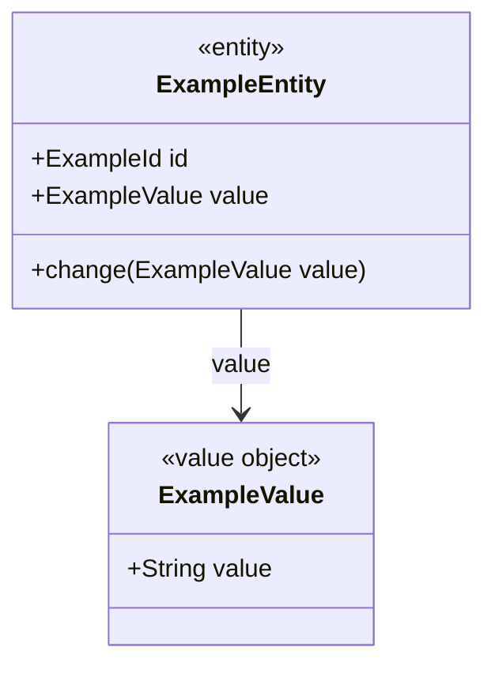

## Minimal `docs/use-cases/<UC-ID>/ddd-design.md` candidate skeleton

```markdown
---
status: candidate
change_set: <CHG-ID>
work_item: <UC-ID>
input_hashes:
  event_storming: sha256:...
---

# <UC-ID>. DDD Candidate Design

## Impact Assessment
|Element Type|Element|Status|Baseline Evidence|Event Storming Evidence|
|---|---|---|---|---|

## Entity / Value Objects
|Entity|Attributes / VOs|Status|Previous Definition|Proposed Definition|Evidence|
|---|---|---|---|---|---|

## Behaviors
|Owner / Service|Signature|Participants|Placement|Policy Evidence|
|---|---|---|---|---|

## Application Flow
|Application Service|Signature|Description|Calls|Evidence|
|---|---|---|---|---|

## Aggregates
|Aggregate|Aggregate Root|Members|Atomic Invariant|Evidence|
|---|---|---|---|---|

## Bounded Contexts
|Bounded Context|Owned Aggregates / Entities|Boundary Reason|Communication Type|Target BC|Evidence|
|---|---|---|---|---|---|

## Integration Impact
- Shared Aggregate / Entity claims to reconcile: <none or concrete candidate claim>
- Candidate-only assumptions / unresolved conflicts: <none or concrete evidence gap>

## Architecture Visualization

<!-- harness:ddd-visualization:entity_vo:start -->
### Entity / Value Objects


<!-- harness:ddd-visualization:entity_vo:end -->

<!-- The behaviors substep replaces the entity_vo range above with one combined
model-and-behavior diagram. Later substeps append managed blocks in this order:
application_flow, aggregates, bounded_contexts.
-->
```

`entity_vo` creates the visualization section. `behaviors` updates the same managed range.
Later substeps append their own subsection. A rerun replaces only the range that substep owns.

`ddd-design.md` is a candidate. `ddd-design-integration` reconciles all candidate
claims for a ChangeSet and is the only DDD stage that may promote an accepted
shared-model delta to `ARCHITECTURE.md`.
