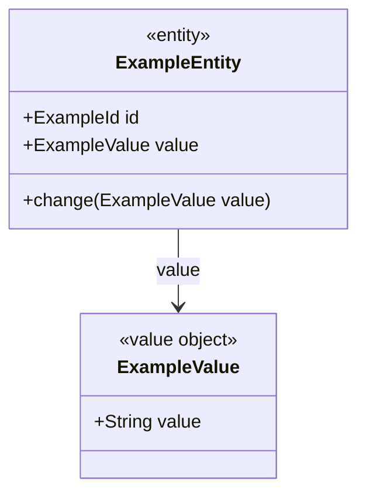

## Minimal `docs/use-cases/<UC-ID>/ddd-design.md` candidate skeleton

```markdown
---
status: candidate
change_set: <CHG-ID>
work_item: <UC-ID>
input_hashes:
  change_set_document: sha256:...
  use_case: sha256:...
  event_storming: sha256:...
  e2e_goal: sha256:...
---

# <UC-ID>. DDD Candidate Design

## Impact Assessment
|Element Type|Element|Status|Baseline Evidence|Event Storming Evidence|
|---|---|---|---|---|

## Entity / Value Objects
|Entity|Attributes / VOs|Status|Previous Definition|Proposed Definition|Evidence|
|---|---|---|---|---|---|

## Behaviors
|Owner / Service|Signature|Participants|Placement|Policy Evidence|
|---|---|---|---|---|

## Application Flow
|Application Service|Signature|Description|Calls|Evidence|
|---|---|---|---|---|

## Aggregates
|Aggregate|Aggregate Root|Members|Atomic Invariant|Evidence|
|---|---|---|---|---|

## Bounded Contexts
|Bounded Context|Owned Aggregates / Entities|Boundary Reason|Communication Type|Target BC|Evidence|
|---|---|---|---|---|---|

## Integration Impact
- Shared Aggregate / Entity claims to reconcile: <none or concrete candidate claim>
- Candidate-only assumptions / unresolved conflicts: <none or concrete evidence gap>

## Architecture Visualization

<!-- harness:ddd-visualization:entity_vo:start -->
### Entity / Value Objects


<!-- harness:ddd-visualization:entity_vo:end -->

<!-- Every visualization substep replaces the entity_vo range above with one
updated Mermaid graph. The graph evolves in this order:
Entity/VO + Behaviors + Aggregates → Application Flow → Bounded Contexts.
Do not append another Mermaid fence or managed range.
-->
```

`entity_vo` creates the visualization section and the only Mermaid graph.
`behaviors`, `aggregates`, `application_flow`, and `bounded_contexts` all update
the same managed range. A rerun replaces that same range after merging supported
claims from any legacy visualization ranges.

`input_hashes` is a runtime contract. Every hash must match the exact current bytes
of the active ChangeSet, use-case slice, event-storming slice, and E2E goal used to
make this candidate. A candidate becomes stale when any declared source changes.

`ddd-design.md` is a candidate. `ddd-design-integration` reconciles all candidate
claims for a ChangeSet and is the only DDD stage that may promote an accepted
shared-model delta to `ARCHITECTURE.md`.