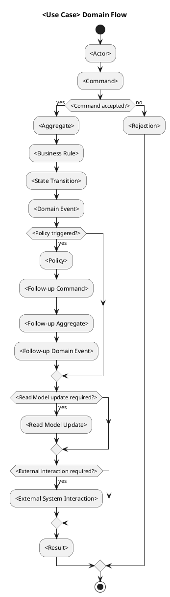
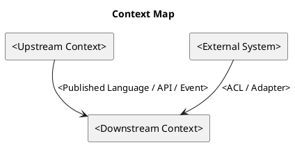
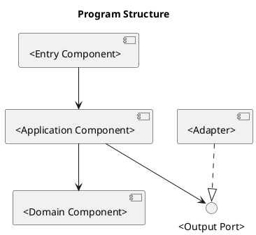
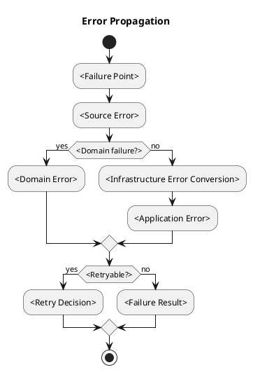
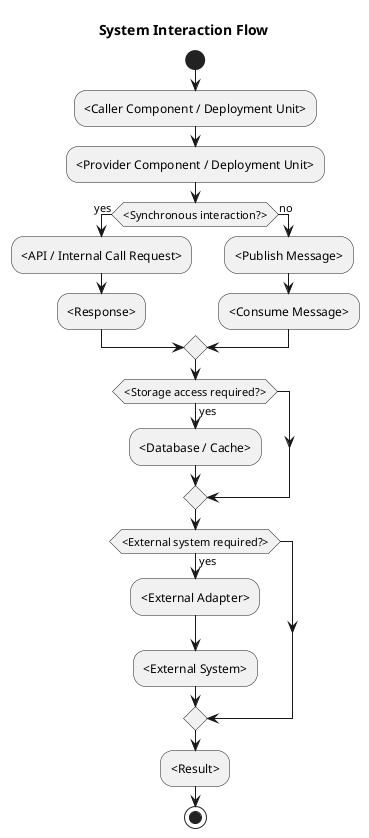
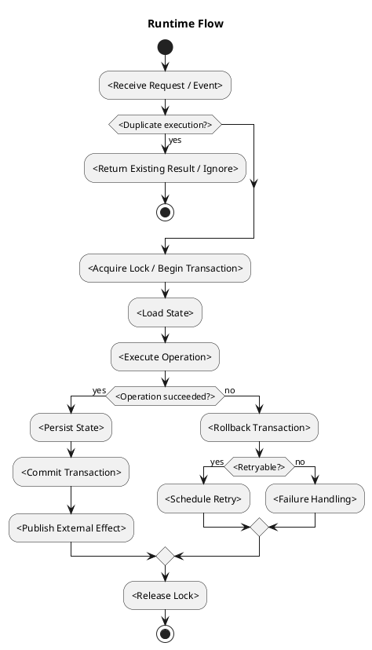
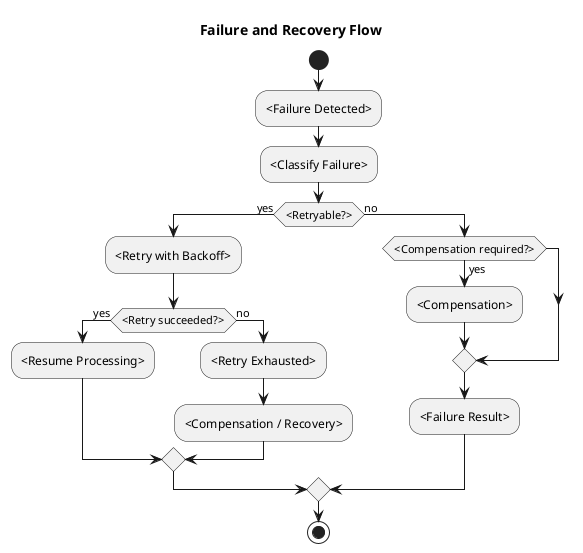

# Architecture Spec

# 1. Design Scope

## 1.1 Target

| 항목                    | 대상            |
| --------------------- | ------------- |
| Product Spec          | `<path>`      |
| Use Cases             | `<use cases>` |
| Domain                | `<domain>`    |
| Bounded Contexts      | `<contexts>`  |
| Existing Services     | `<services>`  |
| External Dependencies | `<systems>`   |
| Affected Data         | `<data>`      |

## 1.2 Product Spec Mapping

| Product Spec 항목      | Architecture 요소                  |
| -------------------- | -------------------------------- |
| `<use case>`         | `<domain flow / program flow>`   |
| `<business rule>`    | `<aggregate / domain component>` |
| `<invariant>`        | `<owner / enforcement point>`    |
| `<state transition>` | `<command / event / component>`  |
| `<failure case>`     | `<error handling / recovery>`    |

---

# 2. Domain Flow

## 2.1 Event Storming Flow



## 2.2 Commands

| Command     | Actor     | Target                  | Input     | Preconditions  | Result             |
| ----------- | --------- | ----------------------- | --------- | -------------- | ------------------ |
| `<command>` | `<actor>` | `<aggregate / context>` | `<input>` | `<conditions>` | `<event / result>` |

## 2.3 Domain Events

| Domain Event | Producer      | Trigger       | Payload     | Consumers     |
| ------------ | ------------- | ------------- | ----------- | ------------- |
| `<event>`    | `<aggregate>` | `<condition>` | `<payload>` | `<consumers>` |

## 2.4 Policies

| Policy     | Trigger Event | Decision | Emitted Command | Owner       |
| ---------- | ------------- | -------- | --------------- | ----------- |
| `<policy>` | `<event>`     | `<rule>` | `<command>`     | `<context>` |

## 2.5 Read Models

| Read Model     | Consumer              | Source            | Fields     | Owner       |
| -------------- | --------------------- | ----------------- | ---------- | ----------- |
| `<read model>` | `<actor / component>` | `<events / data>` | `<fields>` | `<context>` |

## 2.6 External Interactions

| External System | Trigger             | Input     | Output     | Failure     |
| --------------- | ------------------- | --------- | ---------- | ----------- |
| `<system>`      | `<command / event>` | `<input>` | `<output>` | `<failure>` |

## 2.7 Hotspots

| Hotspot         | Options     | Decision     |
| --------------- | ----------- | ------------ |
| `<uncertainty>` | `<options>` | `<decision>` |

---

# 3. DDD Architecture

## 3.1 Bounded Contexts

| Bounded Context | Responsibility     | Ubiquitous Language | Owned Model    | Owned Data |
| --------------- | ------------------ | ------------------- | -------------- | ---------- |
| `<context>`     | `<responsibility>` | `<terms>`           | `<aggregates>` | `<data>`   |

Bounded Context는 기능 이름이나 Aggregate 수에 맞춰 생성하지 않는다. 먼저 capability를 기존 context에 배치하고, 기존 context의 언어·비즈니스 규칙·데이터 lifecycle·일관성 경계로 소유할 수 없을 때만 새로운 Bounded Context로 승격한다.

## 3.1.1 Boundary Decisions

| Capability     | Owner Context | Candidate Boundary                                                        | Chosen Boundary | Why Not Weaker?          | Why Not Stronger?          |
| -------------- | ------------- | ------------------------------------------------------------------------- | --------------- | ------------------------ | -------------------------- |
| `<capability>` | `<context>`   | Domain Type / Aggregate / Internal Capability / Bounded Context / External | `<boundary>`    | `<insufficient reason>`  | `<unnecessary cost/reason>` |

새로운 Bounded Context가 선택되면 `Why Not Weaker?`에 기존 context 내부 capability로 둘 수 없는 이유를 적는다. 이름이 분명하거나 도메인 로직이 존재한다는 사실만으로는 승격 근거가 되지 않는다.

## 3.2 Context Map



| Upstream    | Downstream  | Relationship                                                              | Contract     | Translation              |
| ----------- | ----------- | ------------------------------------------------------------------------- | ------------ | ------------------------ |
| `<context>` | `<context>` | Customer/Supplier / Conformist / ACL / Shared Kernel / Published Language | `<contract>` | `<ACL / adapter / none>` |

## 3.3 Aggregates

| Aggregate     | Root     | Responsibility     | Commands     | Events     | Invariants     |
| ------------- | -------- | ------------------ | ------------ | ---------- | -------------- |
| `<aggregate>` | `<root>` | `<responsibility>` | `<commands>` | `<events>` | `<invariants>` |

Aggregate 경계는 Bounded Context 경계를 자동으로 의미하지 않는다.

## 3.4 Entities

| Entity     | Aggregate     | Identity     | Responsibility     | State     |
| ---------- | ------------- | ------------ | ------------------ | --------- |
| `<entity>` | `<aggregate>` | `<identity>` | `<responsibility>` | `<state>` |

## 3.4.1 Class Diagram

클래스·Aggregate·Value Object·Domain Service의 책임과 의존 관계를 구현 대상 기준으로 표현한다. 변경 대상이 없으면 `해당 없음`과 근거를 적는다.

```plantuml
@startuml
title Domain Class Diagram

class <AggregateRoot> {
    +<command>(<input>): <result>
    -<invariant state>: <type>
}

class <Entity> {
    -<identity>: <type>
    +<behavior>(<input>): <result>
}

class <ValueObject> {
    +<validation>: <rule>
}

interface <RepositoryPort>
class <DomainService>

<AggregateRoot> *-- <Entity>
<AggregateRoot> *-- <ValueObject>
<DomainService> ..> <AggregateRoot>
<RepositoryPort> ..> <AggregateRoot>
@enduml
```

## 3.5 Value Objects

| Value Object     | Aggregate     | Values     | Validation      | Behavior     |
| ---------------- | ------------- | ---------- | --------------- | ------------ |
| `<value object>` | `<aggregate>` | `<values>` | `<constraints>` | `<behavior>` |

## 3.6 Domain Services

| Domain Service | Responsibility     | Input     | Output     | Collaborators    |
| -------------- | ------------------ | --------- | ---------- | ---------------- |
| `<service>`    | `<responsibility>` | `<input>` | `<output>` | `<domain types>` |

## 3.7 Business Rule Ownership

| Business Rule | Owner                                              | Enforcement Point |
| ------------- | -------------------------------------------------- | ----------------- |
| `<rule>`      | Aggregate / Entity / Value Object / Domain Service | `<method>`        |

## 3.8 Aggregate State Transitions

| Current State | Command / Event     | Next State     | Owner         | Preconditions  | Emitted Event |
| ------------- | ------------------- | -------------- | ------------- | -------------- | ------------- |
| `<state>`     | `<command / event>` | `<next state>` | `<aggregate>` | `<conditions>` | `<event>`     |

## 3.8.1 State Diagram

Aggregate 또는 핵심 도메인 객체의 모든 허용 상태, 전이 트리거, guard 조건, 결과 이벤트를 표현한다. 상태가 없으면 `해당 없음`과 근거를 적는다.

```plantuml
@startuml
title <Aggregate> State Diagram

[*] --> <InitialState>
<InitialState> --> <NextState> : <command>\n[<guard>]
<NextState> --> <FinalState> : <command>\n[<guard>] / <event>
<FinalState> --> [*]
@enduml
```

## 3.9 Repository Boundaries

| Repository     | Aggregate     | Operations     | Consistency Boundary |
| -------------- | ------------- | -------------- | -------------------- |
| `<repository>` | `<aggregate>` | `<operations>` | `<boundary>`         |

---

# 4. Program Design

## 4.1 Program Structure



## 4.2 Major Components and Responsibilities

| Component     | Responsibility     | Input     | Output     | Dependencies     | Must Not Do                  |
| ------------- | ------------------ | --------- | ---------- | ---------------- | ---------------------------- |
| `<component>` | `<responsibility>` | `<input>` | `<output>` | `<dependencies>` | `<forbidden responsibility>` |

## 4.3 Application Flow

```plantuml
@startuml
title <Use Case> Program Flow

start

:<Entry Component>;
:<Application Component>;

if (<Input valid?>) then (yes)
    :<Load Required State>;
    :<Domain Operation>;

    if (<Domain operation succeeded?>) then (yes)
        :<Persist State>;

        if (<External effect required?>) then (yes)
            :<Call Output Port>;
        endif

        :<Return Success>;
    else (no)
        :<Convert Domain Failure>;
        :<Return Failure>;
    endif
else (no)
    :<Return Validation Failure>;
endif

stop
@enduml
```



## 4.4 Component Call Contracts

| Order | Caller     | Callee     | Operation     | Input     | Output     | Failure     |
| ----: | ---------- | ---------- | ------------- | --------- | ---------- | ----------- |
|     1 | `<caller>` | `<callee>` | `<operation>` | `<input>` | `<output>` | `<failure>` |

## 4.5 Major Types

| Type     | Kind                                                     | Responsibility     | State     | Dependencies     |
| -------- | -------------------------------------------------------- | ------------------ | --------- | ---------------- |
| `<type>` | Application Service / Domain Type / Port / Adapter / DTO | `<responsibility>` | `<state>` | `<dependencies>` |

## 4.6 Type Design

### `<TypeName>`

| 항목                 | 정의                         |
| ------------------ | -------------------------- |
| Kind               | `<kind>`                   |
| Responsibility     | `<responsibility>`         |
| Dependencies       | `<dependencies>`           |
| Must Not Depend On | `<forbidden dependencies>` |

#### State

| Field     | Type     | Meaning     | Constraint     |
| --------- | -------- | ----------- | -------------- |
| `<field>` | `<type>` | `<meaning>` | `<constraint>` |

#### Behavior

| Method     | Input     | Output     | Responsibility     | State Change     |
| ---------- | --------- | ---------- | ------------------ | ---------------- |
| `<method>` | `<input>` | `<output>` | `<responsibility>` | `<state change>` |

#### Invariants

| Invariant     | Enforcement Point        |
| ------------- | ------------------------ |
| `<invariant>` | `<method / constructor>` |

## 4.7 Interfaces and Function Signatures

### `<InterfaceName>`

```java
interface <InterfaceName> {
    <Output> <method>(<Input> input);
}
```

| 항목             | 정의                 |
| -------------- | ------------------ |
| Responsibility | `<responsibility>` |
| Caller         | `<caller>`         |
| Implementer    | `<implementer>`    |
| Input          | `<input>`          |
| Output         | `<output>`         |
| Preconditions  | `<conditions>`     |
| Postconditions | `<conditions>`     |
| Errors         | `<errors>`         |
| Side Effects   | `<side effects>`   |
| Idempotency    | `<idempotency>`    |

## 4.8 Error Propagation



| Failure Point | Source Error | Converted Error | Handler     | Result     |
| ------------- | ------------ | --------------- | ----------- | ---------- |
| `<component>` | `<error>`    | `<error>`       | `<handler>` | `<result>` |

## 4.9 State Transition Implementation

| State Transition | Domain Owner  | Method     | Persistence Point        | Published Event |
| ---------------- | ------------- | ---------- | ------------------------ | --------------- |
| `<A → B>`        | `<aggregate>` | `<method>` | `<repository / adapter>` | `<event>`       |

## 4.10 Dependency Rules

### Allowed Dependencies

| Source     | Target     | Contract             |
| ---------- | ---------- | -------------------- |
| `<source>` | `<target>` | `<interface / port>` |

### Forbidden Dependencies

| Source     | Forbidden Target |
| ---------- | ---------------- |
| `<source>` | `<target>`       |

---

# 5. Technical Architecture

## 5.1 Boundary Mapping

Bounded Context, internal capability, code module, deployment service를 1:1로 매핑하지 않는다. 각 capability에는 필요한 격리를 만족하는 가장 약한 경계를 선택한다.

| Bounded Context | Internal Capability | Code Boundary                 | Deployment Unit | Boundary Rationale     |
| --------------- | ------------------- | ----------------------------- | --------------- | ---------------------- |
| `<context>`     | `<capability>`      | Package / Module / Process    | `<runtime>`     | `<why this strength>`  |

## 5.2 Boundary Promotion Decisions

| Candidate     | Owner Context | Chosen Boundary                                  | Why Not Weaker?         | Why Not Stronger?        | Introduced Cost                    |
| ------------- | ------------- | ------------------------------------------------ | ----------------------- | ------------------------ | ---------------------------------- |
| `<candidate>` | `<context>`   | Package / Module / Bounded Context / Service     | `<insufficient reason>` | `<unnecessary reason>`   | `<contract/build/runtime overhead>` |

새 module 또는 service는 기능 이름을 물리적 경계로 옮기기 위해 만들지 않는다. Package보다 module이 필요한 이유, module보다 service가 필요한 이유를 각각 증명한다. 미래 MSA 추출 가능성은 소유권과 seam을 보존하는 근거이지 모든 capability를 service 형태로 미리 만드는 근거가 아니다.

## 5.3 System Interaction Flow



## 5.4 Synchronous Communication

| Caller     | Provider     | Protocol               | Operation     | Request     | Response     | Timeout     |
| ---------- | ------------ | ---------------------- | ------------- | ----------- | ------------ | ----------- |
| `<caller>` | `<provider>` | HTTP / gRPC / Internal | `<operation>` | `<request>` | `<response>` | `<timeout>` |

## 5.5 API Contracts

### `<METHOD /path>`

#### Request

```json
{
  "<field>": "<value>"
}
```

#### Response

```json
{
  "<field>": "<value>"
}
```

#### Errors

| Condition     | Status / Code     | Response     |
| ------------- | ----------------- | ------------ |
| `<condition>` | `<status / code>` | `<response>` |

#### Properties

| Property       | Value          |
| -------------- | -------------- |
| Authentication | `<mechanism>`  |
| Authorization  | `<policy>`     |
| Idempotency    | `<key / none>` |
| Timeout        | `<duration>`   |
| Compatibility  | `<strategy>`   |

## 5.6 Asynchronous Communication

| Producer     | Consumer     | Channel                    | Message     | Delivery                     | Ordering  |
| ------------ | ------------ | -------------------------- | ----------- | ---------------------------- | --------- |
| `<producer>` | `<consumer>` | `<topic / queue / stream>` | `<message>` | at-most-once / at-least-once | `<scope>` |

## 5.7 Message Contracts

### `<MessageName>`

```json
{
  "messageId": "<id>",
  "aggregateId": "<id>",
  "version": "<version>",
  "occurredAt": "<timestamp>",
  "payload": {}
}
```

| Property           | Value        |
| ------------------ | ------------ |
| Message ID         | `<field>`    |
| Aggregate ID       | `<field>`    |
| Schema Version     | `<version>`  |
| Idempotency Key    | `<field>`    |
| Ordering Key       | `<field>`    |
| Duplicate Handling | `<behavior>` |
| Failure Handling   | `<behavior>` |
| Compatibility      | `<strategy>` |

## 5.8 Data Ownership

| Data     | Owner                 | Storage     | Key / Schema     | Readers     | Writers     |
| -------- | --------------------- | ----------- | ---------------- | ----------- | ----------- |
| `<data>` | `<context / service>` | `<storage>` | `<key / schema>` | `<readers>` | `<writers>` |

## 5.9 Schema Changes

| Target                     | Action                | Schema Change | Migration     | Compatibility     |
| -------------------------- | --------------------- | ------------- | ------------- | ----------------- |
| `<table / key / document>` | Add / Modify / Delete | `<change>`    | `<migration>` | `<compatibility>` |

## 5.10 Consistency Model

| Operation     | Consistency       | Source of Truth | Synchronization | Recovery     |
| ------------- | ----------------- | --------------- | --------------- | ------------ |
| `<operation>` | Strong / Eventual | `<source>`      | `<mechanism>`   | `<strategy>` |

## 5.11 Infrastructure Dependencies

| Dependency                    | Responsibility     | Accessed By   | Isolation Boundary |
| ----------------------------- | ------------------ | ------------- | ------------------ |
| `<DB / cache / broker / API>` | `<responsibility>` | `<component>` | `<adapter>`        |

## 5.12 External Dependency Isolation

| External Dependency | Port     | Adapter     | Internal Model | Conversion Point |
| ------------------- | -------- | ----------- | -------------- | ---------------- |
| `<dependency>`      | `<port>` | `<adapter>` | `<model>`      | `<converter>`    |

## 5.13 File and Module Structure

### Existing Structure

```text
<existing structure>
```

### Target Structure

```text
<target structure>
```

### File Change Map

| Path     | Action                | Type / Component | Responsibility     |
| -------- | --------------------- | ---------------- | ------------------ |
| `<path>` | Add / Modify / Delete | `<type>`         | `<responsibility>` |

---

# 6. Runtime Design

## 6.1 Runtime Flow



## 6.2 Concurrent Access

| Shared Resource | Concurrent Actors | Conflict                                  |
| --------------- | ----------------- | ----------------------------------------- |
| `<resource>`    | `<actors>`        | Race / Duplicate / Lost Update / Ordering |

## 6.3 Concurrency Control

| Target     | Control Unit | Strategy                                  | Owner     | Timeout     |
| ---------- | ------------ | ----------------------------------------- | --------- | ----------- |
| `<target>` | `<unit>`     | Lock / Atomic Operation / Optimistic Lock | `<owner>` | `<timeout>` |

## 6.4 Ordering

| Operation     | Ordering Scope                    | Ordering Key | Enforcement   |
| ------------- | --------------------------------- | ------------ | ------------- |
| `<operation>` | Global / Aggregate / Event / User | `<key>`      | `<mechanism>` |

## 6.5 Transaction Boundaries

| Transaction     | Owner     | Operations     | Commit Condition | Rollback Condition |
| --------------- | --------- | -------------- | ---------------- | ------------------ |
| `<transaction>` | `<owner>` | `<operations>` | `<commit>`       | `<rollback>`       |

## 6.6 Idempotency

| Operation     | Idempotency Key | Detection Point         | Duplicate Result |
| ------------- | --------------- | ----------------------- | ---------------- |
| `<operation>` | `<key>`         | `<component / storage>` | `<result>`       |

## 6.7 Partial Failure

| Failure Situation | Persisted State | External State | Recovery     |
| ----------------- | --------------- | -------------- | ------------ |
| `<failure>`       | `<state>`       | `<state>`      | `<recovery>` |

---

# 7. Error Handling and Recovery

## 7.1 Failure and Recovery Flow



## 7.2 Error Classification

| Error     | Category                                        | Retryable | Handler     | Caller Result |
| --------- | ----------------------------------------------- | --------- | ----------- | ------------- |
| `<error>` | Validation / Domain / Conflict / Infrastructure | Yes / No  | `<handler>` | `<result>`    |

## 7.3 Retry Policy

| Operation     | Retry Condition | Max Attempts | Backoff      | Exhausted Result |
| ------------- | --------------- | -----------: | ------------ | ---------------- |
| `<operation>` | `<condition>`   |    `<count>` | `<strategy>` | `<result>`       |

## 7.4 Compensation

| Failure     | Trigger     | Compensation | Compensation Failure |
| ----------- | ----------- | ------------ | -------------------- |
| `<failure>` | `<trigger>` | `<action>`   | `<follow-up>`        |

## 7.5 Recovery

| Failure     | Recovery Point | Recovery Input | Recovery Action |
| ----------- | -------------- | -------------- | --------------- |
| `<failure>` | `<point>`      | `<input>`      | `<action>`      |

## 7.6 Rollback

| Target                             | Rollback Strategy | Data Handling | Compatibility     |
| ---------------------------------- | ----------------- | ------------- | ----------------- |
| `<application / schema / message>` | `<strategy>`      | `<handling>`  | `<compatibility>` |

---

# 8. Security

## 8.1 Authentication and Authorization

| Entry Point     | Authentication | Authorization | Failure    |
| --------------- | -------------- | ------------- | ---------- |
| `<entry point>` | `<mechanism>`  | `<policy>`    | `<result>` |

## 8.2 Input Validation

| Input     | Validation     | Sanitization     | Size Limit |
| --------- | -------------- | ---------------- | ---------- |
| `<input>` | `<validation>` | `<sanitization>` | `<limit>`  |

## 8.3 Sensitive Data

| Data     | Storage Protection | Transport Protection | Log Policy  |
| -------- | ------------------ | -------------------- | ----------- |
| `<data>` | `<protection>`     | `<protection>`       | `<masking>` |

## 8.4 Secrets

| Secret     | Storage     | Consumer     | Rotation     |
| ---------- | ----------- | ------------ | ------------ |
| `<secret>` | `<storage>` | `<consumer>` | `<rotation>` |

---

# 9. Observability

## 9.1 Logs

| Component     | Event     | Level               | Context         |
| ------------- | --------- | ------------------- | --------------- |
| `<component>` | `<event>` | INFO / WARN / ERROR | `<identifiers>` |

## 9.2 Metrics

| Metric     | Type                        | Labels     | Trigger Point |
| ---------- | --------------------------- | ---------- | ------------- |
| `<metric>` | Counter / Gauge / Histogram | `<labels>` | `<component>` |

## 9.3 Tracing

| Span     | Parent     | Attributes     | Error Condition |
| -------- | ---------- | -------------- | --------------- |
| `<span>` | `<parent>` | `<attributes>` | `<condition>`   |

## 9.4 Alerts

| Alert     | Condition     | Severity           | Action     |
| --------- | ------------- | ------------------ | ---------- |
| `<alert>` | `<condition>` | Warning / Critical | `<action>` |

---

# 10. Change Boundaries

## 10.1 Allowed Changes

| Target                       | Allowed Change |
| ---------------------------- | -------------- |
| `<module / file / contract>` | `<change>`     |

## 10.2 Forbidden Changes

| Target                       | Forbidden Change |
| ---------------------------- | ---------------- |
| `<module / file / contract>` | `<change>`       |

## 10.3 Conditional Changes

| Target     | Condition     | Required Decision |
| ---------- | ------------- | ----------------- |
| `<target>` | `<condition>` | `<decision>`      |

---

# 11. Verification Requirements

## 11.1 Domain Verification

| Target                  | Verification         |
| ----------------------- | -------------------- |
| `<business rule>`       | `<test / assertion>` |
| `<aggregate invariant>` | `<test / assertion>` |
| `<state transition>`    | `<test / assertion>` |

## 11.2 Program Verification

| Target                       | Verification     |
| ---------------------------- | ---------------- |
| `<component responsibility>` | `<verification>` |
| `<call contract>`            | `<verification>` |
| `<interface signature>`      | `<verification>` |
| `<dependency rule>`          | `<verification>` |

## 11.3 Technical Contract Verification

| Contract                                 | Test Level             | Verification     |
| ---------------------------------------- | ---------------------- | ---------------- |
| `<API / message / persistence contract>` | Integration / Contract | `<verification>` |

## 11.4 Runtime Verification

| Condition                                             | Execution Model | Expected Result |
| ----------------------------------------------------- | --------------- | --------------- |
| `<concurrency / transaction / idempotency condition>` | `<execution>`   | `<result>`       |

## 11.5 Recovery Verification

| Failure     | Injection Method | Expected Recovery |
| ----------- | ---------------- | ----------------- |
| `<failure>` | `<method>`       | `<recovery>`      |

## 11.6 Agent Verifier Criteria

### Domain

* [ ] Capability와 Bounded Context가 구분되어 있음
* [ ] 새 Bounded Context가 weaker boundary로 충분하지 않은 근거를 가짐
* [ ] Bounded Context 책임 준수
* [ ] Aggregate 경계 준수
* [ ] 비즈니스 규칙 소유권 준수
* [ ] 상태 전이 및 불변식 준수

### Program Design

* [ ] 주요 컴포넌트 책임 일치
* [ ] 인터페이스와 함수 시그니처 일치
* [ ] 호출 흐름 일치
* [ ] 오류 전파 방식 일치
* [ ] 의존성 규칙 준수

### Technical Architecture

* [ ] Bounded Context / capability / code boundary / deployment unit 매핑 일치
* [ ] 새 module 또는 service 경계가 weaker boundary로 충분하지 않은 근거를 가짐
* [ ] API와 메시지 계약 준수
* [ ] 데이터 소유권 준수
* [ ] 외부 의존성 격리
* [ ] 파일과 모듈 구조 일치

### Runtime

* [ ] 동시성 제어 준수
* [ ] 트랜잭션 경계 준수
* [ ] 순서 보장 준수
* [ ] 멱등성 준수
* [ ] 실패 복구 준수

### Scope

* [ ] 허용된 변경 범위 준수
* [ ] 금지된 변경 없음
* [ ] 불필요한 구조 변경 없음

### Evidence

* 실행 명령:
* 테스트 결과:
* 변경 파일:
* Architecture 위반:
* Contract 위반:
* 미검증 항목:
* Human Review 항목:

---

# 12. Alternatives and Trade-offs

| Decision     | Option     | Advantages     | Disadvantages     | Result                 |
| ------------ | ---------- | -------------- | ----------------- | ---------------------- |
| `<decision>` | `<option>` | `<advantages>` | `<disadvantages>` | Adopt / Reject / Defer |

---

# 13. Risks and Open Questions

## 13.1 Risks

| Risk     | Impact              | Probability         | Mitigation     |
| -------- | ------------------- | ------------------- | -------------- |
| `<risk>` | High / Medium / Low | High / Medium / Low | `<mitigation>` |

## 13.2 Open Questions

| Question     | Blocking | Resolution     |
| ------------ | -------- | -------------- |
| `<question>` | Yes / No | `<resolution>` |
