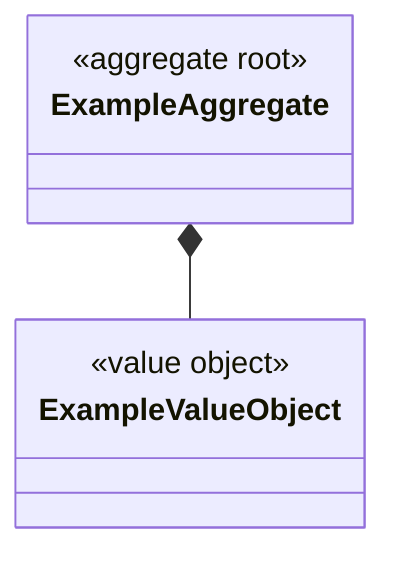
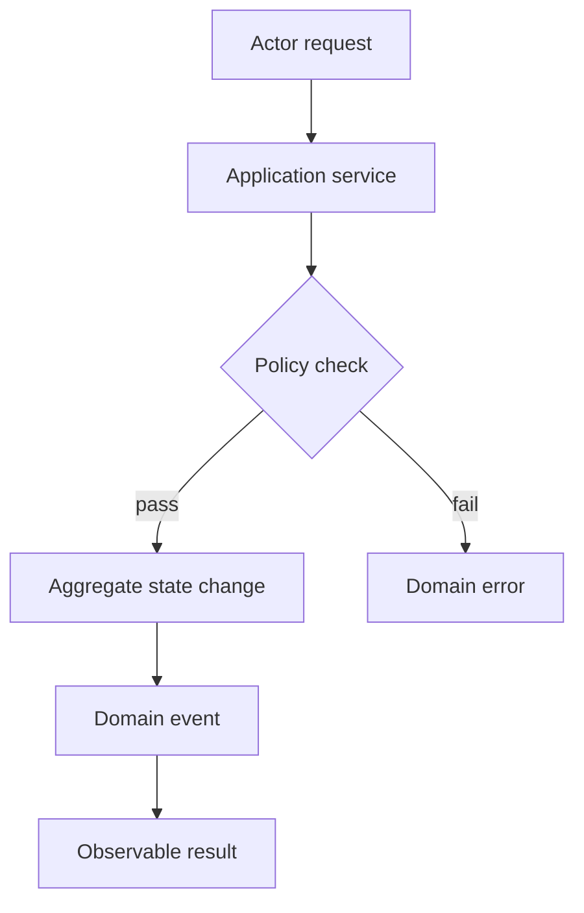

# harness-design-visualization Detailed Instructions

- Skill entrypoint: `.codex/skills/harness-design-visualization/SKILL.md`

## Purpose

승인된 유스케이스 설계를 구현 계획 직전에 시각 산출물로 고정한다. 이 단계는 설계의 정본을 새로
결정하는 단계가 아니다. `use-case.md`, `event-storming.md`, `ddd-design.md`,
`technical-decisions.md`의 근거를 Mermaid 다이어그램으로 표현하고, 상위 입력이 바뀌면
재생성이 필요함을 메타데이터로 추적한다.

## Required Inputs

- `docs/changes/active/<CHG-ID>.md`
- `context.md`
- `docs/use-cases/<UC-ID>/use-case.md`
- `docs/use-cases/<UC-ID>/e2e-goal.md`
- `docs/use-cases/<UC-ID>/event-storming.md`
- `docs/use-cases/<UC-ID>/ddd-design.md`
- `docs/use-cases/<UC-ID>/technical-decisions.md` with `Approval Status: approved`
- `ARCHITECTURE.md`

## Required Outputs

- `docs/use-cases/<UC-ID>/class-diagram.md`
- `docs/use-cases/<UC-ID>/flow-diagram.md`
- `docs/use-cases/<UC-ID>/diagram-metadata.json`

## Workflow

1. 입력 문서가 존재하고 기술 결정이 승인 상태인지 확인한다.
2. 입력 사이에서 aggregate, 상태 전이, 외부 시스템, 실패·재시도 정책이 모순되는 경우 새 결정을 만들지 말고 upstream blocker를 보고한다.
3. 클래스 다이어그램을 생성한다. Aggregate root, Entity, Value Object, domain service, repository port, 외부 adapter/ACL과 aggregate 경계를 표현한다.
4. 플로우 다이어그램을 생성한다. Actor, 시작 조건, 정상·예외 흐름, 상태 변경, 이벤트/비동기 경계, 외부 시스템, 사용자 관측 결과를 표현한다.
5. 각 파일에 Mermaid code fence를 포함한다. 클래스 다이어그램은 `classDiagram`을 사용한다. 플로우 다이어그램은 `flowchart`, `sequenceDiagram`, 또는 `stateDiagram`을 사용한다.
6. 메타데이터에 모든 필수 입력 파일의 SHA-256을 기록한다.
7. 정본 설계와 모순이 있거나 미결정 내용이 있으면 `status: verified`를 기록하지 않고 차단 사유를 보고한다.

## Boundaries

포함:

- 승인된 aggregate, entity, value object, service, port/adapter 관계
- 승인된 이벤트, 명령, 정책, 상태 전이, 실패·복구·관측성 흐름
- 계획자가 구현 범위와 검증 포인트를 빠르게 파악하기 위한 표현

제외:

- private method, framework 내부 클래스, 모든 DTO의 열거
- 설계 근거가 없는 클래스, 이벤트, 상태, 외부 시스템
- actor goal, 사용자 정책, retention 등 upstream product 결정을 임의로 확정하는 행위
- Mermaid 외의 렌더링 도구나 생성 바이너리 추가

## Output Templates

`class-diagram.md`:

````markdown
# <UC-ID> Class Diagram

## Source of Truth

- `use-case.md`
- `event-storming.md`
- `ddd-design.md`
- `technical-decisions.md`



## Notes

- Aggregate boundary and relationship rationale.
````

`flow-diagram.md`:

````markdown
# <UC-ID> Flow Diagram

## Source of Truth

- `use-case.md`
- `e2e-goal.md`
- `event-storming.md`
- `technical-decisions.md`



## Failure and Recovery Coverage

- Describe which approved failure/retry policy is represented.
````

`diagram-metadata.json`:

```json
{
  "change_set_id": "<CHG-ID>",
  "uc_id": "<UC-ID>",
  "status": "verified",
  "source_documents": {
    "docs/use-cases/<UC-ID>/use-case.md": "sha256:<digest>",
    "docs/use-cases/<UC-ID>/e2e-goal.md": "sha256:<digest>",
    "docs/use-cases/<UC-ID>/event-storming.md": "sha256:<digest>",
    "docs/use-cases/<UC-ID>/ddd-design.md": "sha256:<digest>",
    "docs/use-cases/<UC-ID>/technical-decisions.md": "sha256:<digest>",
    "context.md": "sha256:<digest>",
    "ARCHITECTURE.md": "sha256:<digest>"
  }
}
```

## Gate

- 세 산출물이 모두 존재하고 비어 있지 않아야 한다.
- class diagram에는 `classDiagram`, flow diagram에는 지원되는 Mermaid flow 타입이 있어야 한다.
- `TBD`, `To be derived`, `Needs confirmation`을 남길 수 없다.
- metadata의 ChangeSet/UC/status와 모든 입력 해시가 현재 입력과 정확히 일치해야 한다.
- 계획 작성과 ChangeSet 실행 전 resolver가 이 gate를 다시 검사한다.
