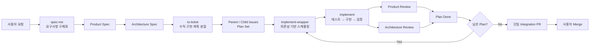
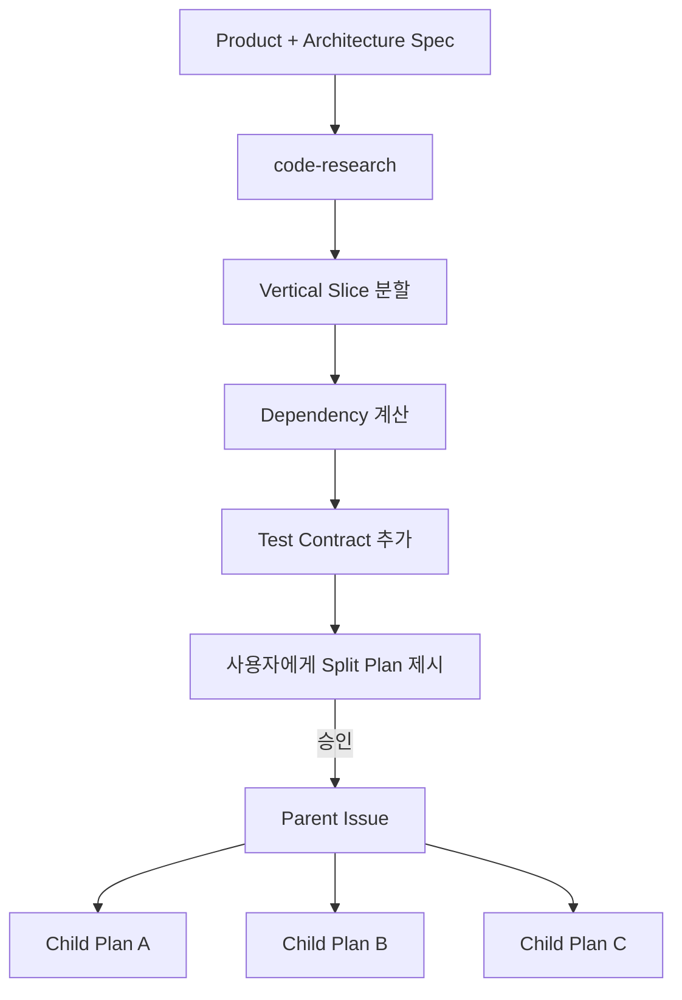
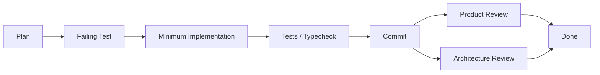

# Harness Codex

**Harness Codex는 한 번의 긴 AI 코딩 세션 대신, 요구사항 정의 → 설계 → 계획 → 구현 → 검증 → PR을 각각 명확한 계약과 검증 게이트로 연결하는 Codex 개발 워크플로우다.**

핵심 목표는 AI에게 모든 일을 한 번에 맡기는 것이 아니라, 각 단계에서 필요한 정보와 책임을 제한하고 다음 단계로 넘어가기 전에 결과를 검증하는 것이다.



## 왜 이런 구조인가

LLM 기반 개발은 한 에이전트가 긴 대화 안에서 요구사항, 설계, 구현, 테스트, 리뷰까지 모두 맡을수록 초기 가정과 오래된 context가 뒤 단계까지 전파되기 쉽다.

Harness Codex는 이 문제를 다음 원칙으로 줄인다.

- **요구사항과 설계를 분리한다.** Product 단계에서는 구현 구조를 정하지 않고, Architecture 단계에서만 코드베이스와 기술 설계를 다룬다.
- **결정과 문서 작성을 분리한다.** 상위 에이전트가 요구사항과 설계를 결정하고, 경량 문서 에이전트는 확정된 내용만 문서화한다.
- **큰 작업을 수직 슬라이스로 나눈다.** 레이어별 작업이 아니라 독립적으로 검증 가능한 사용자 가치 단위로 계획한다.
- **Plan마다 새 실행 context를 사용한다.** 이전 Plan의 추론이나 임시 가정이 다음 Plan으로 자연스럽게 새어 들어가지 않도록 한다.
- **구현과 리뷰를 분리한다.** 구현 에이전트가 자기 결과를 스스로 승인하지 않는다.
- **Product와 Architecture를 서로 다른 축으로 리뷰한다.** 기능 요구사항을 만족하는지와 설계 계약을 지키는지를 별도로 검증한다.
- **자동 merge하지 않는다.** Harness는 PR까지 준비하지만 최종 merge 결정은 사용자에게 남긴다.

---

# 전체 워크플로우

## 1. `spec-me` — 모호한 요청을 구현 가능한 명세로 바꾼다

예를 들어 사용자가 다음처럼 요청했다고 가정한다.

> 로그인 실패 횟수가 너무 많으면 계정을 잠그고 싶어.

Harness는 바로 코드를 수정하지 않는다.

`spec-me`는 먼저 별도 session branch/worktree에서 Product Spec과 Architecture Spec을 순서대로 만든다.

```text
사용자 요청
   │
   ▼
Product Interview
   │
   ├─ 무엇을 해야 하는가?
   ├─ 어떤 예외가 있는가?
   ├─ 성공 조건은 무엇인가?
   └─ 사용자가 기대하는 동작은 무엇인가?
   │
   ▼
Product Spec
   │
   ▼
Architecture Interview
   │
   ├─ 현재 코드는 어떻게 되어 있는가?
   ├─ 어느 context가 책임지는가?
   ├─ 상태와 경계는 어디에 두는가?
   └─ 어떤 interface / failure contract가 필요한가?
   │
   ▼
Architecture Spec
```

### Product Spec

Product 단계는 **무엇을 만들어야 하는가**를 결정한다.

주요 내용:

- 문제와 목표
- 사용자 흐름
- Use Case
- 비즈니스 규칙
- 예외와 실패 조건
- Acceptance Criteria
- 필요한 경우 Use Case / Activity / Business State 다이어그램

중요한 제약은 **Product Spec 단계에서 source code와 test code를 읽지 않는다는 것**이다.

현재 코드가 그렇게 되어 있다는 이유만으로 그것을 제품 요구사항으로 취급하지 않는다.

예를 들어 현재 시스템이 로그인 실패 5회 후 잠기도록 구현되어 있어도, Product 단계에서는 그것이 정말 원하는 정책인지 사용자에게 확인해야 한다.

### `grill-with-docs`

Product와 Architecture 단계의 질문은 단순히 질문 개수를 채우는 방식이 아니다.

각 Spec에는 coverage checklist가 있고, `grill-with-docs`가 아직 결정되지 않은 항목만 한 번에 하나씩 질문한다.

```text
SETTLED        → 이미 결정됨
PARTIAL        → 일부만 결정됨
UNRESOLVED     → 결정 필요
NOT_APPLICABLE → 이번 변경에는 필요 없음
```

`PARTIAL`이나 `UNRESOLVED`인 중요한 항목이 남아 있으면 다음 단계로 넘어가지 않는다.

질문 수 자체는 목표가 아니다. 이미 충분히 구체적인 요청이라면 질문 없이 통과할 수도 있고, 중요한 결정이 많다면 여러 차례 인터뷰가 이어질 수 있다.

### Architecture Spec

Product Spec이 완료되면 Architecture 단계가 시작된다.

Architecture 단계는 **어떻게 구현할 것인가**를 결정한다.

이 단계부터 `code-research`를 사용해 실제 source/test 구조와 기존 설계를 조사한다.

주요 내용:

- Bounded Context와 책임
- Aggregate / Entity / Value Object / Domain Service
- 상태와 전이
- interface와 호출 계약
- dependency 방향
- persistence / integration 경계
- runtime behavior
- failure handling
- 기존 코드에서 변경되는 영역
- 필요한 경우 Class / Design State 다이어그램

Harness는 도메인 개념이 하나 생겼다는 이유만으로 곧바로 새 module이나 service를 만들지 않는다.

```text
Domain Concept
      ↓
Entity / Value Object / Domain Service
      ↓
Aggregate
      ↓
Internal Capability
      ↓
Bounded Context
      ↓
Code Module
      ↓
Deployment Service
```

가능하면 **요구사항을 만족하는 가장 약한 경계**를 사용하고, 더 강한 경계가 필요한 경우 그 이유를 명시한다.

### Spec 산출물

```text
docs/specs/<ticket-id>/
├─ product-spec.md
├─ architecture-spec.md
└─ diagrams/
   ├─ product/
   │  ├─ *.puml
   │  └─ *.svg
   └─ architecture/
      ├─ *.puml
      └─ *.svg
```

`.puml`이 다이어그램의 편집 가능한 원본이고 SVG는 렌더 결과다.

다이어그램이 필요한 경우 source, SVG render, Markdown link, Spec 내용과의 일치 여부까지 확인되어야 해당 Spec 단계가 완료된다.

---

## 2. `to-ticket` — Spec을 실행 가능한 수직 Plan으로 나눈다

두 Spec이 완성되면 `to-ticket`이 구현 계획을 만든다.



### Vertical Slice

Plan은 단순히 Controller / Service / Repository처럼 레이어별로 나누지 않는다.

각 Plan은 가능한 한 **하나의 의미 있는 동작을 구현하고 독립적으로 검증할 수 있는 단위**가 된다.

예:

```text
❌ Layer Split

Plan 1: Entity 작성
Plan 2: Repository 작성
Plan 3: Service 작성
Plan 4: Controller 작성


✅ Vertical Slice

Plan 1: 실패 횟수 기록 + 잠금 전이
Plan 2: 잠긴 계정 로그인 차단
Plan 3: 관리자 잠금 해제
```

각 Plan에는 다음 정보가 포함된다.

- 구현 목적
- scope
- dependency
- Acceptance Criteria
- unit test contract
- `ui ~ entity` E2E contract
- 관련 Product / Architecture Spec
- 관련 diagram

### Plan Set

GitHub tracker mode에서는 하나의 변경이 다음 구조가 된다.

```text
Parent Issue
├─ Child Issue / Plan A
├─ Child Issue / Plan B
└─ Child Issue / Plan C
```

각 Child Issue는 실제 구현 가능한 하나의 split plan이다.

Harness는 Markdown 링크만 만들어 hierarchy처럼 보이게 하지 않고 GitHub Sub-issues 관계를 실제로 생성하고 검증한다.

계획이 승인되고 Issue가 만들어지면 전체 Plan Set을 위한 **하나의 Draft Plan PR**을 만든다.

이 시점의 PR은 구현 완료 PR이 아니다.

```text
Draft Plan PR

- Parent / Child Issue
- 실행 순서
- dependency
- Product Spec
- Architecture Spec
- diagrams
- planning validation
```

---

## 3. `implement-wrapper` — 어떤 Plan을 언제 실행할지 결정한다

Plan이 여러 개라면 바로 순서대로 실행하지 않는다.

`implement-wrapper`가 dependency와 shared resource를 확인해 실행 가능한 Plan을 계산한다.

```text
Plan A ───────► Plan C

Plan B ───────► Plan D

A와 B가 서로 독립적이면
        ↓
    병렬 실행 가능

같은 파일/상태를 동시에 수정할 가능성이 높으면
        ↓
      순차 실행
```

Wrapper가 반환하는 핵심 개념은 다음과 같다.

```text
ready_plans       지금 실행 가능
waiting_plans     dependency 대기
parallel_groups   동시에 실행 가능
single_slot       충돌 위험 때문에 단독 실행
```

Wrapper 자체는 구현 코드를 수정하지 않는다.

역할은 **scheduler / router**이고 실제 코드는 각 `implement` 실행이 담당한다.

### Fresh Context

각 Plan은 반드시 새 `implement` 실행 context에서 시작한다.

```text
Plan A
  → Agent A
  → 완료
  → context 종료

Plan B
  → 새 Agent B
```

Plan A를 구현하면서 생긴 임시 추론이나 오래된 context를 Plan B가 그대로 이어받지 않도록 하기 위한 규칙이다.

Plan이 너무 커서 한 context 안에서 안전하게 다음 작업을 수행하기 어렵다고 판단되면 같은 Plan 안에서도 checkpoint를 남기고 새 context로 handoff한다.

```text
Plan A / Agent 1
      │
      ├─ 일부 구현
      ├─ 테스트
      └─ checkpoint
             │
             ▼
       Plan A / Agent 2
```

checkpoint는 실행 상태를 전달하기 위한 것이며 공식 Plan 상태를 대체하지 않는다.

---

## 4. `implement` — 하나의 Plan만 구현한다

`implement`는 한 번에 정확히 하나의 승인된 Plan만 처리한다.



기본 실행 순서는 다음과 같다.

1. 해당 Plan과 ticket-scoped Product / Architecture Spec을 다시 읽는다.
2. 구현 전 `HEAD`를 review fixed point로 기록한다.
3. 합의된 seam에 **실패하는 테스트를 먼저 작성한다.**
4. 그 테스트를 통과시키는 최소 코드를 구현한다.
5. Plan-specific test와 typecheck를 실행한다.
6. 실제 server/E2E 실행이 필요하면 별도의 `execution_runner`가 실행과 log 수집만 담당한다.
7. 구현 결과를 commit한다.
8. fixed point부터 현재 HEAD까지의 diff를 `code-review`에 넘긴다.
9. 두 리뷰가 모두 해결된 뒤에만 Plan을 `Done`으로 변경한다.

구현 도중 예상보다 큰 architecture 변경이나 Plan scope 밖 수정이 필요해지면 임의로 scope를 넓히지 않고 blocker로 올린다.

---

## 5. `code-review` — 구현자를 믿는 대신 두 축으로 다시 검증한다

구현이 끝났다고 곧바로 완료 처리하지 않는다.

동일한 diff를 서로 독립된 두 reviewer가 읽는다.

```text
                    Implementation Diff
                           │
              ┌────────────┴────────────┐
              ▼                         ▼
     Standards Reviewer          Spec Reviewer
              │                         │
              ▼                         ▼
       Product Spec 기준        Architecture Spec 기준
       기능/정책 만족?          설계 계약 만족?
```

### Standards Reviewer

Product Spec을 기준으로 확인한다.

- 요구한 사용자 동작이 실제로 구현됐는가
- Acceptance Criteria를 만족하는가
- repository convention을 위반하지 않는가
- architecture constraint / ADR을 깨뜨리지 않는가
- 명백한 code smell이나 구조 문제가 없는가

### Spec Reviewer

Architecture Spec을 기준으로 확인한다.

- Spec에서 요구한 구조가 빠지지 않았는가
- 구현이 target architecture와 다른 방향으로 가지 않았는가
- Spec에 없는 구조가 불필요하게 추가되지 않았는가
- interface / state / dependency 계약이 지켜졌는가

두 결과는 하나의 평균 점수나 단일 verdict로 합치지 않는다.

한쪽이 통과하더라도 다른 쪽의 blocker를 가릴 수 없다.

---

## 6. Plan 완료와 dependency 해제

한 Plan이 테스트와 두 리뷰를 모두 통과하면 tracker에서 `Done`이 된다.

GitHub mode의 기본 상태 흐름은 다음과 같다.

```text
Planned
   ↓
In Progress
   ↓
Done

또는

In Progress
   ↓
Blocked
```

Plan이 `Done`이 되는 즉시 해당 Plan을 기다리던 dependency를 다시 계산한다.

즉 전체 PR이 merge될 때까지 기다렸다가 다음 Plan을 실행하는 구조가 아니다.

```text
Plan A Done
    │
    └────► Plan C dependency 해제
                  │
                  └────► 실행 가능
```

---

## 7. `gh-open-pr` — Plan Set 전체를 하나의 PR로 정리한다

각 Child Plan마다 PR을 만드는 것이 아니다.

**Plan Set 하나당 PR 하나**가 원칙이다.

```text
Parent Issue
├─ Plan A ─ Done
├─ Plan B ─ Done
└─ Plan C ─ Done
       │
       ▼
하나의 Integration PR
```

`to-ticket` 단계에서 이미 Draft Plan PR이 존재한다면 구현 완료 후 새로운 PR을 하나 더 만들지 않고 기존 PR을 implementation PR로 업데이트한다.

Implementation PR의 `Summary`는 repo-local `eli5` skill을 사용한다.

```text
한 문장으로 무엇이 바뀌었는지

Before → After
Before → After
Before → After
```

그리고 다음 내용을 연결한다.

- Parent Issue
- 모든 Child Issue
- Product Spec
- Architecture Spec
- 변경된 diagrams
- test / verification 결과

모든 구현과 검증이 끝나면 draft 상태를 해제할 수 있지만 Harness가 자동 merge하지는 않는다.

최종 merge는 사용자가 결정한다.

---

# Agent 역할

Harness의 agent는 같은 일을 여러 번 하는 복제본이 아니라 역할별로 권한과 입력이 다르다.

| Agent / Role | 책임 | 하지 않는 일 |
| --- | --- | --- |
| `spec_document_writer` | 확정된 Product / Architecture 결정을 문서 템플릿에 기록 | 새로운 요구사항이나 설계 결정 |
| `diagram_creator` | 확정된 Spec을 PlantUML과 SVG로 표현 | 요구사항/Architecture 결정 |
| `implementation_agent` / `implement` | 한 Plan의 테스트와 구현 | 다른 Plan까지 확장 |
| `execution_runner` | server/E2E 실행, polling, log 수집 | 구현 파일 수정 |
| `standards_reviewer` | Product Spec + repository rules 기준 리뷰 | 구현 수정 |
| `spec_reviewer` | Architecture Spec 기준 리뷰 | 구현 수정 |

이렇게 역할을 분리해 **결정하는 agent, 작성하는 agent, 실행하는 agent, 검증하는 agent**가 서로 같은 책임을 가지지 않도록 한다.

---

# Durable Context

Ticket 하나의 Spec과 프로젝트 전체에서 유지해야 하는 지식은 구분한다.

```text
CONTEXT.md
    프로젝트 공통 용어 / ubiquitous language

CONTEXT-MAP.md
    bounded context와 관계

docs/specs/<ticket-id>/...
    특정 변경에 대한 Product / Architecture 결정
```

`CONTEXT.md`는 모든 과거 작업을 쌓아두는 대화 메모리가 아니라 **공통 언어를 유지하는 glossary**다.

Architecture에서 새 bounded context나 책임 관계가 확정되면 `CONTEXT-MAP.md`에 반영한다.

Ticket에만 필요한 일시적인 설계 설명은 ticket-scoped Spec에 남긴다.

---

# Workflow Gate

각 단계에는 다음 단계로 넘어가기 위한 gate가 있다.

```text
Spec
 └─ coverage / ambiguity / diagram gate

Planning
 └─ approval / issue structure / dependency gate

Implementation
 └─ tests / typecheck / runtime verification gate

Review
 └─ Product review + Architecture review

PR
 └─ 전체 Plan terminal 상태 / verification gate
```

Harness의 중요한 특징은 **문서나 코드를 생성했다는 사실 자체를 완료로 보지 않는 것**이다.

각 단계에서 필요한 증거가 있어야 다음 단계로 진행한다.

---

# 대표 사용 흐름

새 기능을 처음부터 구현하는 경우:

```text
spec-me
  ↓
Product Spec
  ↓
Architecture Spec
  ↓
to-ticket
  ↓
Plan 승인
  ↓
implement-wrapper
  ↓
implement × N
  ↓
code-review × N
  ↓
gh-open-pr
  ↓
사용자 Merge
```

이미 명세가 있고 구현만 필요한 경우에는 앞 단계를 건너뛸 수 있다.

버그나 regression처럼 먼저 원인을 찾아야 하는 문제는 `spec-me`가 아니라 `diagnosing-bugs`에서 시작한다.

---

# 설치

현재 프로젝트에 Harness를 설치한다.

```bash
npx --yes github:omegafrog/harness-codex install
```

설치되는 핵심 파일:

```text
.agents/skills/*
.codex/agents/*
.codex/workflows/*
.codex/harness.yaml
harness-lock.json
```

업데이트:

```bash
npx --yes github:omegafrog/harness-codex update --project <target-project>
```

로컬 변경을 현재 기준으로 다시 기록:

```bash
npx --yes github:omegafrog/harness-codex lock --project <target-project>
```

설치 상태와 workflow / permission / installer drift 점검:

```bash
npx --yes github:omegafrog/harness-codex-doctor --project <target-project> --native-profile eval-workspace
```

---

**한 줄로 요약하면:** Harness Codex는 AI에게 “코드 좀 만들어줘”라고 한 번에 맡기는 대신, **요구사항 → 설계 → 계획 → 작은 구현 → 독립 검증**의 반복 가능한 개발 프로세스로 바꾼다.
