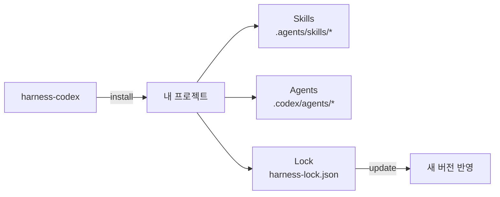
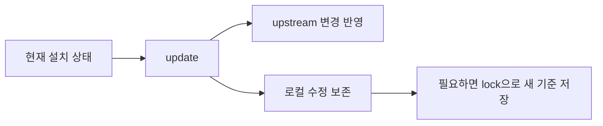

# Harness Codex

**Harness Codex는 Codex용 workflow skill과 agent profile을 내 프로젝트 안에 설치해 주는 도구다.**



설치하면 필요한 skill과 agent가 **project-local 파일**로 들어가고, 이후 `update`로 안전하게 갱신할 수 있다.

## 1. 설치

현재 프로젝트에 설치:

```bash
npx --yes github:omegafrog/harness-codex install
```

로컬 checkout을 개발 중일 때만 저장소 root에서:

```bash
npx . install --project <target-project>
```

설치 결과의 핵심 구조:

```text
<target-project>/
├─ .agents/skills/*
├─ .codex/agents/
│  ├─ code_researcher.toml
│  ├─ spec_reviewer.toml
│  ├─ standards_reviewer.toml
│  ├─ spec_document_writer.toml
│  └─ execution_runner.toml
└─ harness-lock.json
```

## 2. 필요한 것만 설치

```text
전체 설치
   ├─ --skills-only  → skill만
   └─ --agents-only  → agent profile만
```

기존 agent profile은 기본적으로 덮어쓰지 않는다.

의도적으로 덮어쓰려면:

```bash
npx --yes github:omegafrog/harness-codex install --force
```

## 3. 업데이트



업데이트:

```bash
npx --yes github:omegafrog/harness-codex update --project <target-project>
```

현재 상태를 새 기준으로 기록:

```bash
npx --yes github:omegafrog/harness-codex lock --project <target-project>
```

`update`는 unchanged/upstream 변경만 반영하고, locally modified/conflict 파일은 보존한다.

## 4. 이상할 때

설치 상태와 workflow·permission·installer drift를 점검한다.

```bash
npx --yes github:omegafrog/harness-codex-doctor --project <target-project> --native-profile eval-workspace
```

**한 줄로 기억하면:** `install`로 넣고 → 프로젝트에서 사용하고 → `update`로 갱신한다.
