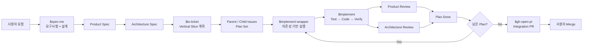
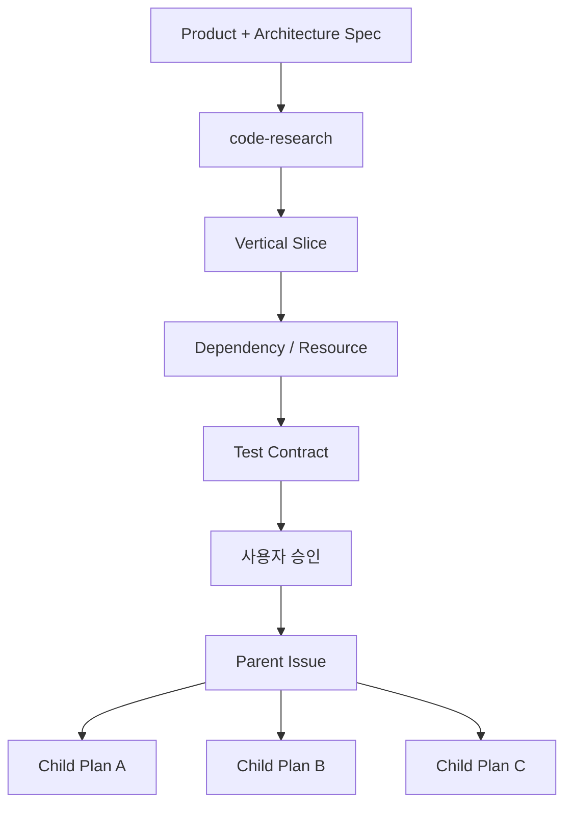
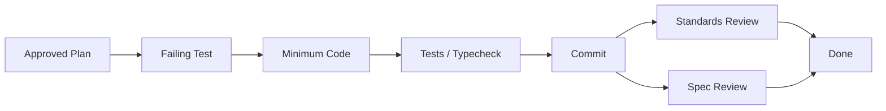

# Harness Codex

**Harness Codex는 한 번의 긴 AI 코딩 세션 대신, 요구사항 정의 → 설계 → 계획 → 구현 → 검증 → PR을 명확한 역할과 검증 게이트로 연결하는 Codex 개발 워크플로우다.**

핵심 목표는 AI에게 모든 일을 한 번에 맡기는 것이 아니라, 각 단계의 입력·책임·완료 조건을 제한하고 다음 단계로 넘어가기 전에 결과를 검증하는 것이다.



## 빠르게 사용하기

Codex에서 Harness skill은 `$skill-name` 형태로 명시적으로 호출할 수 있다. `.codex/openai.yaml`은 implicit invocation도 허용하지만, 중요한 workflow의 시작점은 직접 지정하는 편이 명확하다.

새 프로젝트라면:

```text
$setup
```

새 기능이나 구조 변경을 구체화하려면:

```text
$spec-me 로그인 실패가 일정 횟수를 넘으면 계정을 잠그고 싶어
```

Spec이 승인된 뒤 구현 계획으로 나누려면:

```text
$to-ticket
```

승인된 여러 Plan을 의존성과 충돌을 고려해 실행하려면:

```text
$implement-wrapper
```

버그나 regression처럼 먼저 원인을 찾아야 한다면 `spec-me` 대신:

```text
$diagnosing-bugs 로그인 요청이 간헐적으로 500을 반환한다
```

흐름을 아주 단순하게 설명받고 싶다면:

```text
$eli5 implement-wrapper가 여러 plan을 실행하는 방식
```

---

# 주요 명령

일반적으로 사용자가 직접 시작점으로 쓰는 skill은 다음과 같다.

| 명령 | 언제 쓰나 | 결과 |
| --- | --- | --- |
| `$setup` | Harness를 처음 적용하거나 context/model/tracker 설정이 비어 있을 때 | `CONTEXT.md`, `CONTEXT-MAP.md`, `.codex/harness.yaml` 등의 초기 설정 |
| `$spec-me <요청>` | 새 기능, 정책, 구조 변경을 구현 전에 구체화할 때 | Product Spec + Architecture Spec |
| `$to-ticket` | 승인된 Spec을 구현 단위로 나눌 때 | Parent/Child Issue 또는 local plan + dependency graph |
| `$implement-wrapper` | 여러 승인 Plan을 실행할 때 | 실행 가능 Plan 계산, 병렬/순차 scheduling, fresh-context handoff |
| `$implement` | 승인된 단일 Plan만 직접 실행할 때 | test-first 구현 + 검증 + review + tracker 상태 갱신 |
| `$diagnosing-bugs <문제>` | 장애, regression, flaky behavior의 원인을 찾아 고칠 때 | reproduce → minimise → hypothesis → instrumentation → fix → regression test |
| `$code-research <범위>` | 코드베이스 구조를 먼저 파악하고 싶을 때 | 구현 세부를 과도하게 복사하지 않은 architecture-focused summary |
| `$code-review` | fixed point 이후 diff를 독립적으로 검증할 때 | Product/Standards review + Architecture/Spec review |
| `$gh-open-pr` | 완성된 plan set을 GitHub PR로 정리할 때 | draft plan PR 또는 검증 완료 integration PR |
| `$eli5 <주제>` | 복잡한 개념을 그림 중심으로 빠르게 이해하고 싶을 때 | 한 문장 + 단순 visual + 최소 설명 |

`$product-spec`, `$architecture-spec`, `$event-storming`, `$ddd-design` 같은 하위 skill도 직접 호출할 수 있지만, 전체 개발 흐름에서는 상위 workflow가 필요한 시점에 조합하도록 두는 것이 기본 사용법이다.

---

# Skill Catalog

저장소에는 현재 다음 19개 skill이 있다. 소스는 `.codex/skills/<skill>/SKILL.md`에 있고 설치 대상 프로젝트에서는 `.agents/skills/<skill>/SKILL.md`로 복사된다.

## Workflow / entrypoint

| Skill | 역할 |
| --- | --- |
| [`setup`](.codex/skills/setup/SKILL.md) | repository context, agent model tier, tracker를 초기화한다. |
| [`spec-me`](.codex/skills/spec-me/SKILL.md) | 사용자 요청을 Product Spec과 Architecture Spec으로 만든다. 구현으로 바로 넘어가지 않는다. |
| [`to-ticket`](.codex/skills/to-ticket/SKILL.md) | 승인된 Spec을 vertical implementation slice와 dependency로 분해한다. |
| [`implement-wrapper`](.codex/skills/implement-wrapper/SKILL.md) | 여러 Plan을 dependency/resource conflict에 따라 scheduling하고 fresh implementation context로 dispatch한다. |
| [`implement`](.codex/skills/implement/SKILL.md) | 승인된 Plan 하나만 test-first로 구현하고 검증·review·상태 갱신까지 수행한다. |
| [`diagnosing-bugs`](.codex/skills/diagnosing-bugs/SKILL.md) | 깨진 동작이나 regression을 재현하고 최소화해 root cause를 좁힌 뒤 regression test와 함께 수정한다. |
| [`gh-open-pr`](.codex/skills/gh-open-pr/SKILL.md) | Plan Set 단위의 draft/implementation PR을 만들거나 갱신한다. 자동 merge는 하지 않는다. |

## Specification / design

| Skill | 역할 |
| --- | --- |
| [`product-spec`](.codex/skills/product-spec/SKILL.md) | 구현 결정을 하지 않고 사용자 요구, use case, business rule, acceptance criteria를 확정한다. |
| [`architecture-spec`](.codex/skills/architecture-spec/SKILL.md) | 완료된 Product Spec을 구현 가능한 architecture contract로 바꾼다. |
| [`code-research`](.codex/skills/code-research/SKILL.md) | 현재 code/test 구조를 조사하고 architecture 관점의 compact summary를 만든다. |
| [`event-storming`](.codex/skills/event-storming/SKILL.md) | use-case 흐름을 actor, command, event, policy, external system으로 펼친다. |
| [`ddd-design`](.codex/skills/ddd-design/SKILL.md) | event-storming 결과에서 aggregate, consistency, transaction, integration boundary를 도출한다. |
| [`codebase-design`](.codex/skills/codebase-design/SKILL.md) | DDD 결정을 package, seam, adapter, file, test 같은 실제 codebase 구조로 번역한다. |
| [`domain-modeling`](.codex/skills/domain-modeling/SKILL.md) | ubiquitous language와 domain 관계를 다듬고 장기적으로 남길 결정을 기록한다. |

## Interview / validation / utility

| Skill | 역할 |
| --- | --- |
| [`grilling`](.codex/skills/grilling/SKILL.md) | plan/design의 가정과 trade-off를 한 번에 한 질문씩 압박 검증한다. |
| [`grill-with-docs`](.codex/skills/grill-with-docs/SKILL.md) | coverage checklist를 기준으로 질문하고, 확정된 vocabulary와 durable decision을 문서에 반영한다. |
| [`code-review`](.codex/skills/code-review/SKILL.md) | fixed point 이후 diff를 Standards와 Spec 두 독립 reviewer로 검증한다. |
| [`plantuml-diagrams`](.codex/skills/plantuml-diagrams/SKILL.md) | ticket-scoped `.puml` 원본과 SVG render를 생성·검증한다. |
| [`eli5`](.codex/skills/eli5/SKILL.md) | 이미 파악된 내용을 visual-first, low-text 형식으로 단순하게 설명한다. |

`eli5`는 조사나 설계를 대신하는 skill이 아니다. `code-research`, `spec-me`, `diagnosing-bugs` 등이 사실과 결정을 먼저 만든 뒤 **설명 레이어**에 적용하는 것이 원칙이다.

---

# Workflow Manifests

Skill이 “무엇을 해야 하는가”를 정의한다면 `.codex/workflows/*.yaml`은 여러 role과 gate를 어떤 순서로 실행할지를 정의한다.

| Workflow | Stage | 핵심 gate |
| --- | --- | --- |
| `spec-me` | Product → Product Diagram → Architecture → Architecture Diagram | product coverage, material ambiguity, architecture coverage, diagram completion |
| `to-ticket` | Tickets | dependency/resource preflight, required outcome, evidence |
| `implement-wrapper` | Implementation → Standards Review + Spec Review | tests, review, evidence, tracker reconciliation |
| `code-review` | Standards + Spec | 두 review 결과와 evidence |

예를 들어 `spec-me` workflow는 Product Spec이 끝나기 전에 Architecture 단계로 넘어가지 않는다. 필요한 다이어그램이 있으면 `.puml` 원본, SVG render, Markdown link, Spec과의 내용 일치까지 완료되어야 stage gate가 열린다.

---

# Agent Profiles

Harness는 같은 agent 하나에게 모든 책임을 주지 않는다. `.codex/agents/*.toml`의 각 profile은 입력과 책임 범위를 분리한다.

| Agent | 책임 |
| --- | --- |
| `code_researcher` | codebase를 읽고 현재 구조와 영향 범위를 compact하게 조사한다. |
| `spec_document_writer` | 이미 확정된 Product/Architecture 결정을 template에 기록한다. 새로운 결정을 만들지 않는다. |
| `diagram_creator` | 확정된 Spec을 PlantUML 원본과 SVG로 표현한다. |
| `to_ticket` | 승인된 두 Spec을 vertical split plan으로 변환한다. |
| `implementation_agent` | 정확히 하나의 승인 Plan만 구현하고 focused verification을 수행한다. |
| `execution_runner` | 실제 server/E2E 실행, polling, log 수집을 담당하며 implementation file은 수정하지 않는다. |
| `standards_reviewer` | Product Spec과 repository rules를 기준으로 implementation diff를 검증한다. |
| `spec_reviewer` | Architecture Spec을 기준으로 implementation diff를 검증한다. |

즉 **결정하는 역할, 문서화하는 역할, 구현하는 역할, 실행 검증하는 역할, 승인하는 역할을 의도적으로 분리**한다.

---

# 전체 워크플로우

## 1. `$setup` — 프로젝트를 Harness가 사용할 수 있는 상태로 만든다

처음 적용할 때는 `setup`이 repository-owned context와 정책을 준비한다.

```text
$setup
  │
  ├─ CONTEXT.md / CONTEXT-MAP.md 확인
  ├─ agent model + reasoning tier 선택
  ├─ tracker 선택
  │    ├─ github
  │    └─ local-markdown
  └─ .codex/harness.yaml 갱신
```

Model은 이름을 하드코딩하지 않고 현재 Codex 환경에서 실제 사용할 수 있는 선택지를 기준으로 정한다. 역할은 크게 high-performance decision, normal implementation, E2E/execution, lightweight work로 나뉜다.

GitHub tracker를 선택하면 Project의 configured `Workflow Status`를 사용하며 기본 lifecycle은 `Planned → In Progress → Done` 또는 `Blocked`다.

## 2. `$spec-me` — 모호한 요청을 Product와 Architecture 계약으로 만든다

예를 들어 다음 요청이 있다고 하자.

> 로그인 실패가 일정 횟수를 넘으면 계정을 잠그고 싶어.

바로 코드를 작성하지 않고 Product와 Architecture 결정을 분리한다.

```text
사용자 요청
   │
   ▼
Product Interview
   │
   ├─ 누가 사용하는가?
   ├─ 어떤 동작을 원하는가?
   ├─ 예외와 실패는?
   └─ 완료 조건은?
   │
   ▼
Product Spec
   │
   ▼
Architecture Interview
   │
   ├─ 현재 구조는?
   ├─ 책임/경계는 어디인가?
   ├─ 상태와 contract는?
   └─ 어떤 코드가 변하는가?
   │
   ▼
Architecture Spec
```

### Product Spec

Product 단계는 **무엇을 만들어야 하는가**만 결정한다.

- 문제와 목표
- 사용자 / use case
- business rule
- 예외와 failure behavior
- acceptance criteria
- 필요한 Product diagram

이 단계에서는 source/test code를 읽지 않는다. 현재 구현이 어떤 방식이라는 이유만으로 그것을 제품 요구사항으로 승격하지 않는다.

### Coverage-driven interview

`product-spec`과 `architecture-spec`은 각각 coverage checklist를 가지고 `grill-with-docs`를 사용한다.

```text
SETTLED        이미 결정됨
PARTIAL        일부 결정됨
UNRESOLVED     사용자 또는 근거가 필요한 결정
NOT_APPLICABLE 이번 변경에는 적용되지 않음
```

질문 개수가 목표가 아니다. 중요한 `PARTIAL`/`UNRESOLVED` 항목이 남아 있으면 계속 질문하고, authoritative input으로 모든 항목이 이미 해결되어 있다면 질문 없이 통과할 수도 있다.

### Architecture Spec

Architecture 단계부터 source/test structure와 기존 설계를 조사한다. `code-research` 결과를 바탕으로 필요할 때 `event-storming → ddd-design → codebase-design`을 조합한다.

```text
Domain Concept
      ↓
Entity / Value Object / Domain Service
      ↓
Aggregate
      ↓
Internal Capability
      ↓
Bounded Context
      ↓
Code Module
      ↓
Deployment Service
```

Harness는 이름이 있는 domain concept마다 service/module을 만드는 방향을 피한다. ownership, consistency, isolation, deployment 같은 요구를 만족하는 **가장 약한 경계**를 우선하고, 더 강한 경계로 승격할 때 이유와 비용을 남긴다.

### Spec 산출물

```text
docs/specs/<ticket-id>/
├─ product-spec.md
├─ architecture-spec.md
└─ diagrams/
   ├─ product/
   │  ├─ *.puml
   │  └─ *.svg
   └─ architecture/
      ├─ *.puml
      └─ *.svg
```

`.puml`이 편집 가능한 원본이고 SVG는 local render 결과다. 필요한 diagram은 source 존재만으로 완료되지 않고 render, Markdown link, Spec 내용과의 consistency까지 검증한다.

## 3. `$to-ticket` — Spec을 Vertical Slice Plan으로 나눈다

완료된 Product/Architecture Spec을 바로 하나의 거대한 구현 prompt로 넘기지 않는다.



레이어별 분할보다 사용자 가치와 독립 검증 가능성을 기준으로 자른다.

```text
❌ Layer split
Entity → Repository → Service → Controller

✅ Vertical slice
실패 횟수 기록 + 잠금 전이
잠긴 계정 로그인 차단
관리자 잠금 해제
```

각 Child Plan은 구현 목적, scope, dependencies, acceptance criteria, unit/E2E test contract, 관련 Spec/diagram을 가진다.

GitHub mode에서는 Parent Issue와 실제 GitHub Sub-issues 관계를 만들고 Project 상태를 관리한다. 승인 전에 Issue나 plan file을 임의로 생성하지 않는다.

## 4. `$implement-wrapper` — Plan 실행 순서를 조율한다

여러 Plan을 단순한 번호 순서로 실행하지 않는다. dependency와 shared-resource conflict를 보고 실행 가능성을 계산한다.

```text
Plan A ─────► Plan C
Plan B ─────► Plan D

A / B 독립 → 병렬 가능
같은 resource 충돌 → 순차 실행
```

Wrapper는 `ready_plans`, `waiting_plans`, `parallel_groups`, `single_slot_plan_ids`와 이유를 계산하지만 구현 코드를 직접 수정하지 않는다.

### Fresh Context / Smart Zone

Plan마다 새 `implementation_agent`를 시작한다.

```text
Plan A → fresh agent → 완료
Plan B → new fresh agent
```

같은 Plan이라도 다음 bounded action을 안전하게 끝낼 context가 부족하다고 판단하면 checkpoint를 기록하고 **같은 Plan을 새 context에서 재개**한다. checkpoint는 handoff 정보일 뿐 tracker의 공식 상태를 대체하지 않는다.

## 5. `$implement` — Plan 하나만 Test-first로 실행한다



핵심 순서는 다음과 같다.

1. 정확히 하나의 Plan과 ticket-scoped Product/Architecture Spec을 다시 읽는다.
2. 구현 전 `HEAD`를 review fixed point로 저장한다.
3. 가능한 seam에 failing test를 먼저 작성한다.
4. 테스트를 통과시키는 최소 변경을 구현한다.
5. focused test와 typecheck를 실행한다.
6. 실제 server/E2E가 필요하면 `execution_runner`가 별도 실행한다.
7. implementation을 commit한다.
8. fixed point 이후 diff를 `code-review`에 전달한다.
9. 두 review가 모두 해결된 뒤에만 Plan을 `Done`으로 바꾼다.

다른 Plan까지 수정해야 하거나 새로운 architecture decision이 필요해지면 scope를 몰래 확장하지 않고 blocker로 올린다.

## 6. `$code-review` — Product와 Architecture를 독립적으로 검증한다

동일한 implementation diff를 서로 다른 두 read-only reviewer가 본다.

```text
                 Implementation Diff
                         │
            ┌────────────┴────────────┐
            ▼                         ▼
 standards_reviewer             spec_reviewer
            │                         │
      Product Spec              Architecture Spec
      + repo rules               contract
```

`standards_reviewer`는 요구한 사용자 동작과 acceptance criteria, repository convention, architecture constraints 등을 본다. `spec_reviewer`는 Architecture Spec에서 빠진 구조, 잘못 구현된 contract, spec 밖의 불필요한 구조를 본다.

두 축을 하나의 평균 점수로 합쳐 한쪽의 blocker가 다른 쪽 결과에 가려지게 하지 않는다.

## 7. Plan 완료와 dependency 해제

Plan이 `Done`이 되는 즉시 그 Plan을 기다리던 dependency를 다시 계산한다. 전체 integration PR이 merge될 때까지 다음 Plan을 막아두지 않는다.

```text
Plan A Done
    │
    └──► Plan C dependency 해제
                │
                └──► 실행 가능
```

## 8. `$gh-open-pr` — Plan Set 하나를 PR 하나로 정리한다

Child Plan마다 PR을 만들지 않는다.

```text
Parent Issue
├─ Plan A — Done
├─ Plan B — Done
└─ Plan C — Done
       │
       ▼
Plan Set Integration PR
```

`to-ticket` 단계에서 이미 draft plan PR이 있다면 구현 완료 뒤 별도 PR을 새로 만들지 않고 그 PR을 implementation PR로 갱신한다.

Implementation PR의 `## Summary`에는 repo-local `eli5` 설명 pass를 사용해 **한 문장 + 최대 세 단계 Before → After**로 변경을 먼저 보여준다. 그 뒤 Plan Set, Spec/diagram, test와 verification evidence를 연결한다.

Harness는 PR을 준비하고 필요한 Issue closing reference를 검증하지만 자동 merge하지 않는다. 최종 merge/close는 사용자가 결정한다.

---

# Bug / Regression 흐름

깨진 동작의 원인을 아직 모르는 상황에서는 `$spec-me`로 새 설계를 시작하지 않는다.

```text
$diagnosing-bugs
   │
   ├─ reproduce
   ├─ minimise
   ├─ hypothesise
   ├─ instrument
   ├─ fix
   └─ regression-test
```

원인 분석 결과가 새로운 product/architecture decision을 요구할 때만 그 결정 영역을 다시 Spec workflow로 올린다.

---

# Durable Context

Ticket 하나의 결정과 프로젝트 전체에서 계속 유지할 지식을 분리한다.

```text
CONTEXT.md
    ubiquitous language / project-wide glossary

CONTEXT-MAP.md
    bounded context / ownership / relationships

docs/specs/<ticket-id>/...
    특정 변경의 Product / Architecture contract
```

`CONTEXT.md`는 대화 기록 저장소가 아니다. 장기적으로 공유해야 할 canonical term만 유지한다. Bounded Context의 책임과 관계는 `CONTEXT-MAP.md`에 두고 ticket 한정 설계는 ticket-scoped Spec에 남긴다.

---

# Workflow Gates

Harness는 파일이나 코드를 “생성했다”는 사실 자체를 완료로 보지 않는다.

```text
Specification
 └─ coverage + ambiguity + diagram gate

Planning
 └─ approval + hierarchy + dependency/resource gate

Implementation
 └─ tests + typecheck + execution evidence

Review
 └─ Product/Standards + Architecture/Spec

PR
 └─ 모든 split plan terminal + verification evidence
```

이 gate가 에이전트가 중간 단계의 불완전한 결과를 다음 단계의 사실처럼 사용하는 것을 막는다.

---

# 터미널 CLI

Codex 안에서 호출하는 `$skill-name`과 repository 관리용 CLI는 별개다.

## `harness-codex`

```text
harness-codex install [options]
harness-codex update [options]
harness-codex lock [options]
```

주요 option:

```text
--project <path>   대상 프로젝트
--skills-only      skill만 설치 (install 전용)
--agents-only      agent profile만 설치 (install 전용)
--force            기존 agent profile 덮어쓰기 (install 전용)
```

`install`은 skill과 agent profile을 project-local로 설치하고 lock을 만든다. `update`는 lock을 기준으로 upstream 변경을 반영하되 locally modified/conflict 파일은 보존한다. `lock`은 현재 상태를 의도적으로 새 baseline으로 기록한다.

## `harness-codex-doctor`

설치 상태와 workflow/permission/config drift를 진단한다.

```text
harness-codex-doctor [--project <path>] [--native-profile <name>] [--json]
```

## `harness-eval`

Harness 자체의 eval suite를 실행한다.

```text
harness-eval run --suite <suite-id> \
  [--config <path>] \
  [--run-id <id>] \
  [--attempt <number> --retry-of <run-id>]
```

---

# 설치

GitHub 저장소에서 현재 프로젝트에 설치:

```bash
npx --yes github:omegafrog/harness-codex install
```

로컬 checkout을 개발 중일 때:

```bash
npx . install --project <target-project>
```

설치 결과의 핵심 구조:

```text
<target-project>/
├─ .agents/skills/*
├─ .codex/agents/*
├─ .codex/workflows/*
├─ .codex/harness.yaml
└─ harness-lock.json
```

업데이트:

```bash
npx --yes github:omegafrog/harness-codex update --project <target-project>
```

현재 local 상태를 새 baseline으로 기록:

```bash
npx --yes github:omegafrog/harness-codex lock --project <target-project>
```

GitHub source를 package로 직접 실행하면서 doctor를 사용하려면:

```bash
npx --yes --package github:omegafrog/harness-codex \
  harness-codex-doctor --project <target-project> --native-profile eval-workspace
```

Harness eval 예시:

```bash
npx --yes --package github:omegafrog/harness-codex \
  harness-eval run --suite <suite-id>
```

---

**한 줄 요약:** Harness Codex는 AI에게 “코드 좀 만들어줘”라고 한 번에 맡기는 대신, **요구사항 → 설계 → vertical plan → fresh-context 구현 → 독립 리뷰 → 단일 integration PR**의 반복 가능한 개발 프로세스로 바꾼다.
