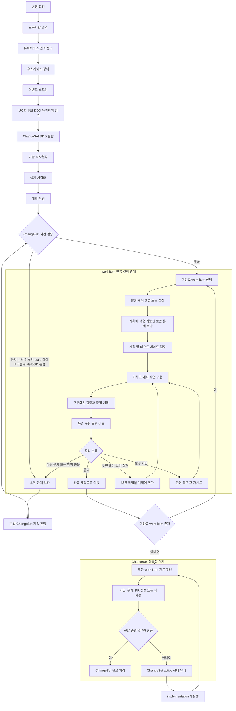

# harness-codex

`harness-codex`는 제품 요청이나 엔지니어링 변경을 **지속 가능한 설계 산출물**, **ChangeSet**,
**검증된 구현 증적**, **재개 가능한 전달 상태**로 전환합니다.

런타임은 대화 이력 대신 파일 기반 산출물을 단계 간 인수인계 계약으로 사용합니다. 이 문서는
현재 활성화된 공개 워크플로우와 실행 경계만 설명하며, 호환성·실험용·미참조 항목은 다루지 않습니다.

## 핵심 개념

- **ChangeSet**: 하나의 일관된 변경을 관리하고 전달하는 단위입니다.
- **work item**: ChangeSet 내부에서 실제로 계획·구현·검증하는 단위입니다.
- **work-item workflow**: 선택된 work item 하나를 완료하는 내부 실행 흐름입니다.
- **ChangeSet finalization workflow**: 모든 work item이 완료된 뒤 한 번만 실행되는 전달 흐름입니다.
- **DDD candidate**: 한 work item의 Event Storming으로부터 도출한 후보 모델입니다. shared Aggregate 정본이 아닙니다.
- **DDD integration**: 모든 후보를 병합·충돌 판정·추적해 ChangeSet 단위 canonical DDD contract로 승격하는 단계입니다.
- 실행 상태, 증적, 보고서, 재개 지점은 `.harness/runs/<RUN-ID>/`에 저장됩니다.

## 전체 워크플로우



## 빠른 시작

대상 저장소의 루트에서 실행합니다. 설치된 대상 저장소에서는 `./harness`를 사용하고,
harness-codex 자체를 로컬 개발할 때는 `python3 -m harness_codex`를 사용할 수 있습니다.

```bash
./harness help
./harness requirements-definition --title "변경 제목" --idea "짧은 제품 또는 엔지니어링 목표"
```

이 명령은 활성 ChangeSet을 생성하거나 갱신합니다. 이후 단계에서는 생성된 ChangeSet ID를 사용합니다.

## 공개 단계 워크플로우

같은 ChangeSet에 대해 다음 단계를 순서대로 실행합니다.

```bash
./harness requirements-definition --title "변경 제목" --idea "짧은 제품 또는 엔지니어링 목표"
./harness ubiquitous-language-definition CHG-YYYYMMDD-001
./harness use-case-definition CHG-YYYYMMDD-001
./harness event-storming CHG-YYYYMMDD-001 --uc UC-001
./harness ddd-architecture-definition CHG-YYYYMMDD-001 --uc UC-001
# 모든 affected UC의 후보 DDD가 준비된 뒤 ChangeSet 단위로 한 번 실행
./harness ddd-design-integration CHG-YYYYMMDD-001 --plan
./harness ddd-design-integration CHG-YYYYMMDD-001 --apply
./harness technical-decisions CHG-YYYYMMDD-001 --uc UC-001
./harness design-visualization CHG-YYYYMMDD-001 --uc UC-001 --apply
./harness plan-writing CHG-YYYYMMDD-001 --uc UC-001
./harness implementation CHG-YYYYMMDD-001 --apply
```

`ddd-architecture-definition`은 selected UC의 후보 설계만 만들며 `ARCHITECTURE.md`를 직접 갱신하지 않습니다.
`ddd-design-integration`은 후보 문서를 단순히 이어 붙이지 않고 Aggregate 소유권, lifecycle, 불변식,
command/event 의미, 유비쿼터스 언어를 비교합니다. 근거 없는 충돌은 자동으로 선택하지 않고 blocked로
반환합니다. accepted 결과만 필요 시 shared `ARCHITECTURE.md`를 갱신합니다.

ChangeSet 파일은 이미 `docs/changes/active/<CHG-ID>.md`를 사용하므로 integration artifact는 같은 이름의
directory가 아닌 다음 sibling path에 기록합니다.

```text
docs/changes/active/<CHG-ID>.ddd-integration.md
docs/changes/active/<CHG-ID>.ddd-integration.json
```

JSON contract에는 candidate input hash, baseline architecture hash, canonical model, provenance, resolution log,
blocked conflict가 저장됩니다. candidate가 바뀌면 hash 불일치로 integration과 downstream 산출물은 stale입니다.

| 단계 | 범위 | 주요 산출물 |
| --- | --- | --- |
| `requirements-definition` | ChangeSet | `docs/design/요구사항.md`, 활성 ChangeSet 상태 |
| `ubiquitous-language-definition` | ChangeSet | `context.md` |
| `use-case-definition` | ChangeSet | `docs/design/유스케이스.md`, 유스케이스 슬라이스 |
| `event-storming` | 유스케이스 하나 | `docs/use-cases/<UC-ID>/event-storming.md` |
| `ddd-architecture-definition` | 유스케이스 하나 | `docs/use-cases/<UC-ID>/ddd-design.md` 후보 |
| `ddd-design-integration` | ChangeSet | canonical integration Markdown/JSON, 필요 시 `ARCHITECTURE.md` |
| `technical-decisions` | 유스케이스 하나 | `docs/use-cases/<UC-ID>/technical-decisions.md` |
| `design-visualization` | 유스케이스 하나 | `class-diagram.md`, `flow-diagram.md`, `diagram-metadata.json` |
| `plan-writing` | 유스케이스 하나 | `docs/plans/active/<UC-ID>/plan.md` |
| `implementation` | ChangeSet의 미완료 work item | 코드, 검증 증적, 완료 계획, 전달 상태 |

단계는 필요한 사용자 입력을 요청하거나 차단 상태를 기록할 수 있습니다. 인용된 상위 산출물을
보완한 뒤 **새 워크플로우를 만들지 말고 동일 ChangeSet을 계속 진행**해야 합니다.

## 구현 워크플로우

`implementation`은 ChangeSet 단위 명령입니다. ChangeSet 안의 미완료 work item을 모두 찾아,
각 항목에 다음 흐름을 반복 적용합니다.

1. 활성 구현 계획을 생성하거나 갱신합니다.
2. 적용 가능한 보안 통제를 계획에 추가합니다.
3. 계획의 범위와 테스트 게이트 계약을 검토합니다.
4. 계획에서 아직 체크되지 않은 작업을 구현합니다.
5. 구조화된 검증을 실행하고 검증 증적을 기록합니다.
6. 구현 결과를 독립적으로 보안 검토합니다.
7. 결과를 통과, 보완 가능, 상위 문서·범위 충돌, 환경 차단 등으로 분류합니다.
8. 통과한 항목만 완료 처리하고, 보완 가능한 실패는 계획에 작업을 추가한 뒤 다시 구현합니다.

통과한 work item의 계획만 다음 경로로 이동합니다.

```text
docs/plans/active/<WORK-ITEM-ID>/plan.md
        ↓
docs/plans/completed/<WORK-ITEM-ID>/plan.md
```

이미 완료된 work item은 다음 `implementation` 실행에서 건너뛰고, 아직 완료되지 않은 항목 또는
ChangeSet 최종화만 다시 평가합니다.

## 재개와 상태 확인

```bash
./harness help
./harness changes list
./harness changes active
./harness changes show CHG-YYYYMMDD-001
./harness changes continue CHG-YYYYMMDD-001 --plan
./harness changes continue CHG-YYYYMMDD-001 --apply
./harness stages list CHG-YYYYMMDD-001
./harness contracts validate CHG-YYYYMMDD-001
./harness resume run-<RUN-ID>
./harness report run-<RUN-ID>
```

## 활성 에이전트와 스킬 카탈로그

- [활성 에이전트](docs/agents.md)
- [활성 스킬](docs/skills.md)

## 런타임 운영 명령

```bash
./harness run app
./harness run wiki build
./harness ui-server
```

저장소별 작업 경계와 검증 명령은 `.codex/repository-settings.md`와
`.codex/test-gate.yaml`에 정의합니다.

## harness-codex 자체 검증

```bash
./venv/bin/python3 -m pytest -q -s tests/runtime
./venv/bin/python3 -m pytest -q -s
node --check harness_codex/runtime/dashboard_assets/dashboard.js
```
