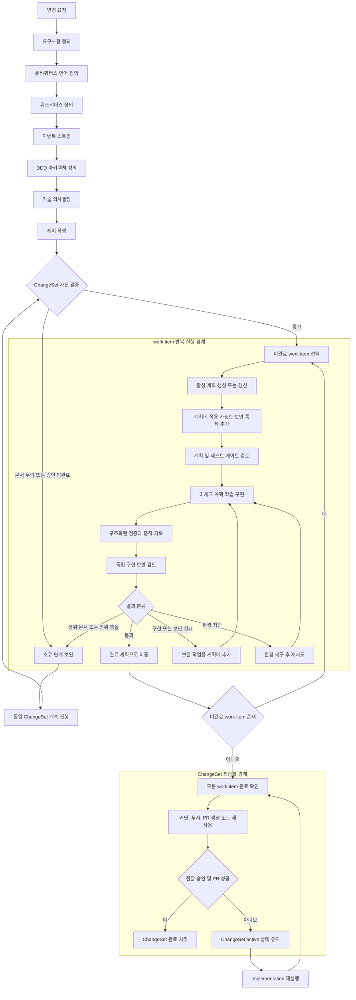

# harness-codex

`harness-codex`는 제품 요청이나 엔지니어링 변경을 **지속 가능한 설계 산출물**, **ChangeSet**,
**검증된 구현 증적**, **재개 가능한 전달 상태**로 전환합니다.

런타임은 대화 이력 대신 파일 기반 산출물을 단계 간 인수인계 계약으로 사용합니다. 이 문서는
현재 활성화된 공개 워크플로우와 실행 경계만 설명하며, 호환성·실험용·미참조 항목은 다루지 않습니다.

## 핵심 개념

- **ChangeSet**: 하나의 일관된 변경을 관리하고 전달하는 단위입니다.
- **work item**: ChangeSet 내부에서 실제로 계획·구현·검증하는 단위입니다.
- **work-item workflow**: 선택된 work item 하나를 완료하는 내부 실행 흐름입니다.
- **ChangeSet finalization workflow**: 모든 work item이 완료된 뒤 한 번만 실행되는 전달 흐름입니다.
- 실행 상태, 증적, 보고서, 재개 지점은 `.harness/runs/<RUN-ID>/`에 저장됩니다.

## 전체 워크플로우

GitHub에서 바로 렌더링되는 Mermaid 다이어그램입니다. 공개 설계 단계, work item 반복 처리,
그리고 ChangeSet 최종 전달 경계를 함께 나타냅니다.



## 빠른 시작

대상 저장소의 루트에서 실행합니다. 설치된 대상 저장소에서는 `./harness`를 사용하고,
harness-codex 자체를 로컬 개발할 때는 `python3 -m harness_codex`를 사용할 수 있습니다.

먼저 `help`로 현재 저장소의 다음 안전한 행동을 확인합니다. 이 명령은 활성 ChangeSet 메타데이터만
읽으며 agent, runner, RunState, 파일을 변경하지 않습니다.

```bash
./harness help
./harness requirements-definition --title "변경 제목" --idea "짧은 제품 또는 엔지니어링 목표"
```

이 명령은 활성 ChangeSet을 생성하거나 갱신합니다. 이후 단계에서는 생성된 ChangeSet ID를 사용합니다.
세부 옵션은 `./harness help requirements-definition` 또는 `./harness help changes continue`에서 확인합니다.

## 공개 단계 워크플로우

같은 ChangeSet에 대해 다음 단계를 순서대로 실행합니다.

```bash
./harness requirements-definition --title "변경 제목" --idea "짧은 제품 또는 엔지니어링 목표"
./harness ubiquitous-language-definition CHG-YYYYMMDD-001
./harness use-case-definition CHG-YYYYMMDD-001
./harness event-storming CHG-YYYYMMDD-001 --uc UC-001
./harness ddd-architecture-definition CHG-YYYYMMDD-001 --uc UC-001
./harness technical-decisions CHG-YYYYMMDD-001 --uc UC-001
./harness plan-writing CHG-YYYYMMDD-001 --uc UC-001
./harness implementation CHG-YYYYMMDD-001 --apply
```

| 단계 | 범위 | 주요 산출물 |
| --- | --- | --- |
| `requirements-definition` | ChangeSet | `docs/design/요구사항.md`, 활성 ChangeSet 상태 |
| `ubiquitous-language-definition` | ChangeSet | `context.md` |
| `use-case-definition` | ChangeSet | `docs/design/유스케이스.md`, 유스케이스 슬라이스 |
| `event-storming` | 유스케이스 하나 | `docs/use-cases/<UC-ID>/event-storming.md` |
| `ddd-architecture-definition` | 유스케이스 하나 | `docs/use-cases/<UC-ID>/ddd-design.md`, 필요 시 `ARCHITECTURE.md` |
| `technical-decisions` | 유스케이스 하나 | `docs/use-cases/<UC-ID>/technical-decisions.md` |
| `plan-writing` | 유스케이스 하나 | `docs/plans/active/<UC-ID>/plan.md` |
| `implementation` | ChangeSet의 미완료 work item | 코드, 검증 증적, 완료 계획, 전달 상태 |

단계는 필요한 사용자 입력을 요청하거나 차단 상태를 기록할 수 있습니다. 인용된 상위 산출물을
보완한 뒤 **새 워크플로우를 만들지 말고 동일 ChangeSet을 계속 진행**해야 합니다.

## 구현 워크플로우

`implementation`은 ChangeSet 단위 명령입니다. ChangeSet 안의 미완료 work item을 모두 찾아,
각 항목에 다음 흐름을 반복 적용합니다.

1. 활성 구현 계획을 생성하거나 갱신합니다.
2. 적용 가능한 보안 통제를 계획에 추가합니다.
3. 계획의 범위와 테스트 게이트 계약을 검토합니다.
4. 계획에서 아직 체크되지 않은 작업을 구현합니다.
5. 구조화된 검증을 실행하고 검증 증적을 기록합니다.
6. 구현 결과를 독립적으로 보안 검토합니다.
7. 결과를 통과, 보완 가능, 상위 문서·범위 충돌, 환경 차단 등으로 분류합니다.
8. 통과한 항목만 완료 처리하고, 보완 가능한 실패는 계획에 작업을 추가한 뒤 다시 구현합니다.

통과한 work item의 계획만 다음 경로로 이동합니다.

```text
docs/plans/active/<WORK-ITEM-ID>/plan.md
        ↓
docs/plans/completed/<WORK-ITEM-ID>/plan.md
```

이미 완료된 work item은 다음 `implementation` 실행에서 건너뛰고, 아직 완료되지 않은 항목 또는
ChangeSet 최종화만 다시 평가합니다.

모든 work item이 완료되면 최종화가 실행됩니다.

1. 모든 대상 work item 계획이 완료되었는지 확인합니다.
2. ChangeSet의 커밋·푸시·PR 생성을 수행하거나 기존 PR을 재사용합니다.
3. 전달이 성공한 경우에만 ChangeSet을 `docs/changes/completed/<CHG-ID>.md`로 이동합니다.

전달은 **fail-closed**입니다. `HARNESS_DELIVERY_APPROVED` 승인 환경이 없거나 PR 전달에 실패하면
ChangeSet은 active 상태로 남습니다.

## 재개와 상태 확인

`./harness help`는 active ChangeSet이 하나면 먼저 `changes continue <CHG-ID> --plan`을 제안합니다.
계획이 맞는지 확인한 뒤에만 `--apply`로 계속 진행합니다.

```bash
./harness help
./harness changes list
./harness changes active
./harness changes show CHG-YYYYMMDD-001
./harness changes continue CHG-YYYYMMDD-001 --plan
./harness changes continue CHG-YYYYMMDD-001 --apply
./harness stages list CHG-YYYYMMDD-001
./harness contracts validate CHG-YYYYMMDD-001
./harness resume run-<RUN-ID>
./harness report run-<RUN-ID>
```

`implementation`은 실행 모드를 명시적으로 선택할 수 있습니다.

```bash
./harness implementation CHG-YYYYMMDD-001 --plan
./harness implementation CHG-YYYYMMDD-001 --preview
./harness implementation CHG-YYYYMMDD-001 --apply
```

## 활성 에이전트와 스킬 카탈로그

카탈로그에는 현재 단계 매핑과 활성 work-item workflow가 실제로 참조하는 ID만 기록합니다.
`.codex/agents/` 또는 `.codex/skills/`에 존재하는 모든 파일을 나열하지 않습니다.

- [활성 에이전트](docs/agents.md)
- [활성 스킬](docs/skills.md)

## 런타임 운영 명령

```bash
./harness run app
./harness run wiki build
./harness ui-server
```

저장소별 작업 경계와 검증 명령은 `.codex/repository-settings.md`와
`.codex/test-gate.yaml`에 정의합니다.

## harness-codex 자체 검증

```bash
./venv/bin/python3 -m pytest -q -s tests/runtime
./venv/bin/python3 -m pytest -q -s
node --check harness_codex/runtime/dashboard_assets/dashboard.js
```

산출물 계약, 대시보드 동작, 운영 규칙은 `docs/wiki.md`를 참고하세요.
