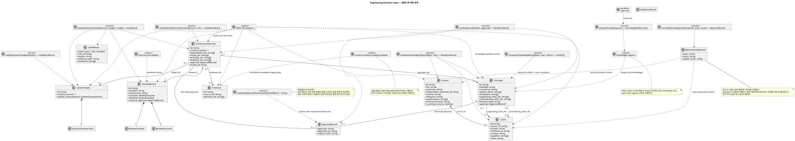
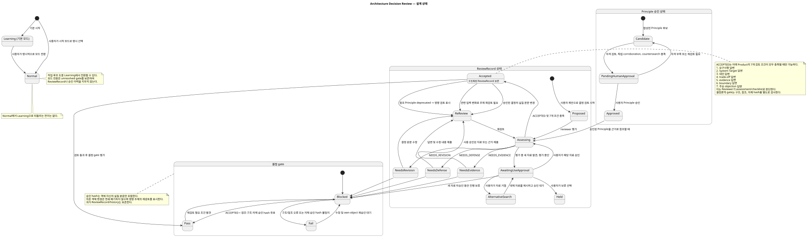
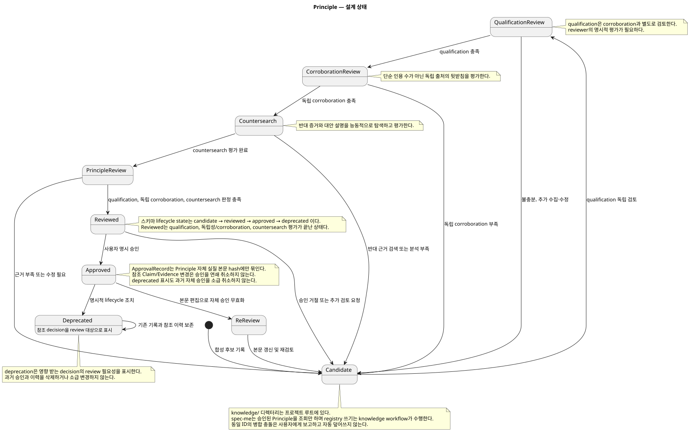

# Architecture Spec

# 1. Design Scope

## 1.1 Target

| 항목 | 대상 |
|---|---|
| Product Spec | [product-spec.md](product-spec.md) |
| Use Cases | UC-001–UC-004 |
| Domain | Engineering Decision Layer; System Target, Architecture Decision, Source, Claim, Principle, Local Evidence |
| Bounded Contexts | 기존 `harness/control-plane` 하나 |
| Existing Services | Node.js ESM Harness runtime 및 orchestration agent |
| External Dependencies | 조사 도구(발견은 가능하며 Reviewer가 사용하기 전 사용자 승인 필요) |
| Affected Data | ticket별 YAML 산출물, 프로젝트 로컬 Knowledge, 비추적 runtime journal/staging |

## 1.2 Product Spec Mapping

| Product Spec 항목 | Architecture 요소 |
|---|---|
| UC-001, BR-001–005 | System Target 수집 및 Architecture Decision 검증/저장 |
| UC-002, BR-006–007, BR-011, BR-015 | review record, objection 참조 및 review gate |
| UC-003, BR-008–010, BR-016–017 | Knowledge 내부 capability와 human approval |
| UC-004, BR-014 | 로컬 evidence staging 및 승인된 요약 publish |
| BR-012–013 | workflow mode/history와 Principle 영향 표시 |
| BR-018 | 최종 architecture/ADR의 구조화된 참조 |
| AC-001–016 | `spec-me` stage evaluator, helper validation, compatibility/contract 검증 |

# 2. Domain Flow

## 2.1 Event Storming Flow

이 capability는 기존 `harness/control-plane` 내부의 workflow 처리이며 별도 domain event bus나 비동기 정책을 도입하지 않는다. 아래는 영속 기록과 gate 순서다.

```text
사용자/agent → System Target → Architecture Decision → Reviewer 평가
  → 결정론적 gate → 승인 ticket artifact → 후속 planning
Researcher → Source/Claim 후보 → corroboration + countersearch
  → Principle 종합/검토 → 사용자 승인 → 프로젝트 로컬 registry
Harness 실행 → 로컬 evidence staging → 사용자 승인 요약 → Evidence registry
```

## 2.2 Commands

| Command | Actor | Target | Input | Preconditions | Result |
|---|---|---|---|---|---|
| `validateSystemTargets` | workflow evaluator | System Targets | targets | schema v1 | `ValidationResult` |
| `validateArchitectureDecision` | workflow evaluator | Architecture Decision | decision, refs | schema v1 | `ValidationResult` |
| `evaluateDecisionGate` | stage evaluator | decision/targets/review | objects | references resolved | `GateResult` |
| `recordMaterialApproval` | user-facing workflow | material use approval | presented source/claims, actor, result | exact content presented | approval record |
| `collectRuntimeEvidence` | Harness | local staging | normalized run observation | run event identified | collection result |
| `publishEvidenceSummary` | user + registry adapter | Evidence | candidate, user approval | no raw runtime payload | durable Evidence |

## 2.3 Domain Events

별도 publish/subscribe domain event는 없다. 기존 journal envelope를 사용하는 workflow 이력과 approval/review record만 남긴다. 이는 외부 consumer용 통합 이벤트가 아니다.

## 2.4 Policies

| Trigger | Decision | Owner |
|---|---|---|
| 참조 누락/오류 또는 own approval hash 불일치 | `fail`; 판정 전제/evidence 부족은 `blocked` | 결정론적 gate |
| 미해결 material objection/evidence | 결정 승인 보류 | Reviewer + orchestration agent |
| Researcher가 새 자료 발견 | 자료를 사용자에게 제시하고 Reviewer가 쓰기 전 use-approval 대기 | orchestration workflow |
| evidence write failure | 기존 execute/verify 결과 유지, 별도 기록 및 사용자가 결정한 retry | evidence adapter |
| 병합 시 동일 ID의 내용/approval 충돌 | 사용자에게 보고, 충돌만으로 진행 중 workflow를 중단하지 않음 | merge-time helper |

## 2.5 Read Models

| Read Model | Consumer | Source | Owner |
|---|---|---|---|
| Approved Principle lookup | `spec-me` | project-local Knowledge YAML | knowledge registry (read-only for `spec-me`) |
| gate 결과 | orchestrator | 검증된 ticket artifact + review record | stage evaluator |
| 재개 projection | workflow | 로컬 append-only 이력 | journal adapter |

## 2.6 External Interactions

| System | Trigger | Contract | Failure |
|---|---|---|---|
| 조사 출처/도구 | 명시된 조사 요청 | 출처 provenance를 기록하고 Reviewer가 사용하기 전에 사용자가 승인 | 출처 사용 불가 시 기록 후 대체 출처 탐색 또는 보류; 묵시적 승인 금지 |

새 crawler/server, database, network credential, external mutation interface는 추가하지 않는다.

## 2.7 Hotspots

| Hotspot | Decision |
|---|---|
| Review 의미상 충분성 | 사람 Reviewer/user가 판단; 결정론적 코드는 구조와 기재 여부만 확인 |
| durable/runtime evidence 구분 | 승인된 정규화 요약만 durable; raw runtime은 ADR-003에 따라 로컬 보관 |
| 경계 | 기존 context 안의 내부 capability와 파일 grouping; 신규 BC/service 없음 |

# 3. DDD Architecture

## 3.1 Bounded Contexts

| Bounded Context | Responsibility | Ubiquitous Language | Owned Data |
|---|---|---|---|
| `harness/control-plane` | workflow 불변식, 결정론적 gate, 실행 evidence, orchestration handoff | workflow, gate, evidence, decision artifact | 로컬 journal 및 project 범위 artifact |

## 3.1.1 Boundary Decisions

| Capability | Owner Context | Chosen Boundary | Why Not Weaker? | Why Not Stronger? |
|---|---|---|---|---|
| Decision 검증/review record | `harness/control-plane` | 내부 capability | 파일 단위 helper로 결정론적 소유권 유지 | 독립 lifecycle, 언어, 데이터 소유권, 배포 필요 없음 |
| Knowledge registry/research | `harness/control-plane` | 내부 capability | 동기 workflow와 로컬 파일로 충분 | decision workflow 지원용; 별도 consistency/service lifecycle 없음 |
| Evidence 수집 | `harness/control-plane` | 내부 capability | 기존 runtime이 실행 관측을 소유 | 별도 evidence service는 ADR-003 소유권 중복 |

## 3.2 Context Map

기존 context map 유지. Ticket artifacts는 기존 planner에게 참조로 전달되며 별도 context 간 API나 번역 경계가 아니다.

| 상위 흐름 | 하위 흐름 | 관계 | 계약 |
|---|---|---|---|
| `harness/control-plane` decision workflow | 기존 planning/to-ticket | synchronous file reference | accepted decision/System Target IDs 및 기존 Product/Architecture refs |

## 3.3 Aggregate

트랜잭션 Aggregate는 도입하지 않는다. 각 YAML 객체를 독립 검증하고 원자적으로 교체하며, 객체 간 참조는 gate 시 확인한다.

## 3.4 Entity

| Entity/object | Identity | Responsibility |
|---|---|---|
| System Target, Decision, Review, Source, Claim, Principle, Evidence | immutable type-safe stable ID | structured contract object; schema version 1 |

## 3.4.1 Class Diagram



## 3.5 Value Object

| Value Object | Values | Validation |
|---|---|---|
| Target metric | value/unit 또는 관찰 가능한 경계 조건, provenance, confidence, rationale | 관련 metric만 기록; 수용량을 지어내지 않음 |
| Approval | approver, approved_at, subject_hash | SHA-256 of canonical sorted-key JSON substantive body |
| Review 결과 | `ACCEPTED`, `NEEDS_DEFENSE`, `NEEDS_EVIDENCE`, `NEEDS_REVISION` | Reviewer 평가와 필수 checklist 결과를 명시 |
| Claim locator/context | source ID, locator, retrieval/context/qualifiers | provenance required |

## 3.6 Domain Helper

아래 함수는 순수/internal helper이며 독립 Domain Service나 network service가 아니다.

| Function | Input → Output | Responsibility |
|---|---|---|
| `validateSystemTargets(targets)` | targets → ValidationResult | 필드와 target identity 검증 |
| `validateArchitectureDecision(decision, refs)` | decision/refs → ValidationResult | schema와 명시적 참조 검증 |
| `computeApprovalHash(substantiveObject)` | object → SHA-256 | 객체 자체의 canonical hash |
| `verifyApproval(object, approval)` | object/approval → ValidationResult | hash, approver, timestamp 검증 |
| `evaluateDecisionGate(decision, targets, review)` | objects → GateResult | `pass`/`fail`/`blocked` 판정 |
| `lookupPrinciples(query)` | query → approved + qualified refs | 프로젝트 로컬 read-only 조회 |
| `validateKnowledgeObject(object, refs)` | object/refs → ValidationResult | schema/reference 무결성 검증 |
| `recordMaterialApproval(material, actor, result)` | 제시된 내용 → approval record | Principle approval과 구별되는 자료 사용 승인 |
| `collectRuntimeEvidence(input)` | 정규화 관측 → collection result | 로컬 staging에 기록 |
| `publishEvidenceSummary(candidate, userApproval)` | candidate/approval → Evidence | 승인된 정규화 요약만 durable Evidence로 publish |
| `compareKnowledgeMerge(base, ours, theirs)` | versions → conflicts | 충돌 보고; 자동 해결하지 않음 |

## 3.6.1 구조화 객체 필드 계약

모든 객체는 `schema_version: 1`, 객체 종류별 안전한 immutable ID, 명시적 참조를 갖는다. 객체 revision field는 없고 Git history가 변경 이력이다.

| 객체 | 필수 의미 필드 |
|---|---|
| System Targets | `system_characteristics`; `initial`, `expected_growth`, `architecture_boundary` 관점별 관련 목표. 각 목표는 안정 ID와 `value`+`unit` 또는 관찰 가능한 경계 조건, `provenance`, `confidence`, `rationale` 포함. 미확정 목표는 명시적으로 미확정으로 기록 |
| Architecture Decision | `category` (`code` 또는 `infrastructure`), `problem`, `constraints`, `requirement_ids`, `target_ids`, `options`, `selected_option`, `rejected_alternatives`와 기각 이유, `rationale`, `tradeoffs`, `principle_ids`, `evidence_ids`, `boundary`, 자체 approval, review 참조 |
| Review | Reviewer 평가자와 assessment, `ACCEPTED`/`NEEDS_DEFENSE`/`NEEDS_EVIDENCE`/`NEEDS_REVISION`, requirement/target/alternatives/tradeoffs/evidence/boundary/objection 답변의 7개 조건, objection ID 및 target/principle/evidence 참조, material approval, 답변과 해결 상태 |
| Source | 출처 주체/위치, tier, authority, `independent_authority_id`, recency, relevance, commercial bias, primary-source 여부, 선호도 및 domain metadata |
| Claim | `source_id`, 원문 locator, retrieved_at, 맥락, 적용 조건/한정 조건, 원자적 주장 |
| Principle | strength (`MUST`/`SHOULD`/`MAY`), 적용 범위의 consensus, `applies_when`, exceptions, `supporting_claim_ids`, `contradicting_claim_ids`, lifecycle state, own approval. `candidate`/`reviewed`는 권위 참조가 아니며 사람 승인 후 `approved` |
| Evidence | origin project, environment, timestamp, type, execution status, measurement validity, observations, source reference, decision IDs. 실패/중단 run은 유효 측정으로 취급하지 않음 |

Source의 검색 tier 순서는 1 Formal Standards, 2 Industry Framework, 3 Primary Technical, 4 Established Expert, 5 Empirical, 6 Community다. Community 자료만으로 Principle을 지지하지 않는다. 독립성은 문서 수가 아닌 `independent_authority_id` 기준으로 센다. Claim은 source locator와 맥락/한정 조건을 보존한다. Principle은 qualification, 독립 corroboration, support 및 필수 countersearch 결과를 기록하며, counter-evidence가 미해결이면 candidate로 남긴다.

Approval hash는 객체 종류별 substantive 필드만 대상으로 한다: Target은 특성/목표, Decision은 결정 내용/참조, Review는 assessment/checklist/objection 해결, Source와 Claim은 출처/주장 내용, Principle은 규범 내용/근거 참조, Evidence는 관측 provenance와 내용이다. 각 종류의 `approval`, `status`, `history`, 파생 review flag는 제외한다. 정렬된 key의 canonical JSON에 SHA-256을 적용하며 dependency 객체 본문 hash를 포함하지 않는다.

## 3.7 Business Rule Ownership

| 규칙 | 소유자 | 강제 지점 |
|---|---|---|
| field/reference/hash integrity | validation helpers | deterministic gate |
| evidence sufficiency, objection resolution, Principle approval | human Reviewer/user | explicit assessment and approval record; code cannot attest semantics |
| learning/normal role boundaries | workflow/orchestration | stage instructions and human wait/resume |
| no cascading approval revocation | object approval model | hash only the approved object's substantive body |

## 3.8 Aggregate State Transitions

| Object | Transition | Guard |
|---|---|---|
| workflow mode | Learning → Normal | explicit user choice/transition; history preserved |
| review | `NEEDS_*` → re-review → `ACCEPTED` | concerns answered; gate checks all seven conditions |
| Principle | candidate → reviewed → approved | qualification, corroboration and countersearch reviewed; human approval |
| Principle | approved → deprecated | explicit lifecycle action; referencing decisions flagged for review |
| own approved object | approved → approval invalidated | substantive body edit changes own hash; no dependent-object cascade |

Normal이 명시 선택되지 않은 신규 workflow는 Learning mode로 시작한다. 사용자는 workflow 입력에서 Normal을 명시 선택할 수 있고 Learning에서 Normal로 전환할 수 있다. 두 방식 모두 현재 입력의 유효 mode로 검증하며 전환 전후 gate 결과와 이력을 보존한다.

## 3.8.1 State Diagram





## 3.9 Repository 경계

| Repository adapter | 작업 | 일관성 경계 |
|---|---|---|
| YAML file adapters | parse, validate, read, temp-write, atomic replace | per file; cross-file refs checked before gate |
| local journal adapter | append history and rebuild resume projection | single writer per stream per ADR-003 pattern |
| runtime evidence staging adapter | write normalized local candidate | local; separate from execution result |

# 4. Program Design

## 4.1 Program Structure

```text
spec-me orchestrator
 ├─ workflow loader / declared stage gates
 ├─ stage-gate evaluator → decision helpers → YAML adapters
 └─ knowledge workflow → knowledge helpers → project-local YAML registry
Harness execution observer → local evidence staging adapter
```

## 4.2 주요 컴포넌트와 책임

| 컴포넌트 | 책임 | 금지 책임 |
|---|---|---|
| workflow loader | closed workflow/stage field와 등록된 gate ID 수용 | 임의 gate 동적 로딩 |
| stage evaluator | 선언된 gate에서 결정론적 구조 검사 실행 | routing, retry, 의미 review 답변 |
| decision helper | 검증, 자체 canonical hash, gate 결과 | evidence 충분성 판단 |
| knowledge helper/adapter | 검증, 조회, approval record, 로컬 쓰기 | `spec-me`의 registry 쓰기 또는 자동 승인 |
| orchestration agent | actor dispatch와 사람 응답 대기/재개 | 사용자 승인 사칭 |
| evidence adapter | 정규화한 로컬 evidence staging | execute/verify 결과 변경 |

## 4.2.1 Workflow Roles and Knowledge Harvest

| 역할 | 책임 / tier |
|---|---|
| `knowledge_source_researcher` | 자료 탐색·분류; low tier |
| `knowledge_claim_extractor` | 발견한 자료에서 Claim 추출·사용자 제시; low tier |
| `knowledge_principle_synthesizer` | scoped Principle 후보 종합; 고인지 판단은 Reviewer에 위임 |
| `knowledge_principle_reviewer` | 자격·독립성·반대 근거와 Principle 후보 평가; high tier |
| `architecture_review_lead` | 공통 review checklist 평가; Learning mode에서만 challenge loop 수행; high tier |
| 사용자 | material use 및 Principle/Decision 승인 | 사람만 수행 |

`.codex/workflows/knowledge-harvest-workflow.yaml`은 `discover → qualify → collect → extract → corroboration → countersearch → synthesis → review → humanapprove → publish` 10단계를 선언한다. source acquisition 및 claim extraction/serialization은 low tier이며 Reviewer의 semantic judgement는 high tier로 유지한다. `architecture_review_lead`의 challenge loop만 Learning mode에서 실행한다. Researcher가 자료를 발견하면 수집/제시할 수 있고, Reviewer가 해당 자료를 근거로 사용하기 전에 사용자가 source/claim 내용을 승인한다. 거절된 자료는 제외하고 대체 자료를 찾거나 보류한다. 이 use-approval은 Principle approval과 별개다. 설치 프로필과 skill asset은 source-of-truth `.codex/skills` 및 설치 복사본 `.agents/skills`에 일치시킨다.

## 4.3 애플리케이션 흐름

1. 기존 Product와 diagram coverage stage를 완료한다.
2. `define-system-targets`에서 관련 target을 수집한다.
3. Architecture 단계에서 decision, human review 및 결과를 기록한다.
4. writer 완료 전 stage evaluator가 아래 gate를 실제 호출해 target, refs, 자체 approval hash, review record를 검사한다.
5. 표시된 ticket에서만 downstream planning이 승인 decision 참조를 검증한다. 기존 marker 없는 spec/plan 동작은 유지한다.

다음 stage gate는 Normal과 Learning 양쪽에 적용한다. Normal에서는 사용자의 decision assessment가 공통 checklist를 충족하고, Learning에서는 Reviewer 검토와 challenge 흐름이 추가된다. `learning_mode`는 validated session/ticket execution input을 바탕으로 평가하는 등록된 CONDITION ID이며 gate ID가 아니다. 이를 정적 workflow YAML에 새 mode field로 넣지 않는다. 신규 condition/gate ID는 각각 명시적 registry/schema 허용 목록과 실행 evaluator를 함께 추가하며 선언만으로 pass 처리하지 않는다.

| Gate ID | 적용 조건 | 동작 |
|---|---|---|
| `system_targets_complete` | System Target 수집 stage 완료 | 구조/필수 목표 검사 |
| `decision_evidence_complete` | Normal 및 Learning 공통 | decision ref 및 evidence 구조 검사; 충분성은 사람 평가 |
| `decision_review_complete` | Normal 및 Learning 공통 | 공통 review checklist/outcome과 승인 참조 검사 |

새 gate 계약은 `.codex/workflows/spec-me.yaml`의 선언, `src/workflow/loader.mjs`의 closed field/gate allowlist, 실제 실행하는 stage evaluator가 함께 반영되어야 한다. 현재 loader는 closed workflow/stage field 및 고정 gate/condition registry를 사용하며, 선언된 stage gate를 실제 실행하는 evaluator는 별도 추가 대상이다.

Knowledge workflow는 자료 발견, 자격 확인, 수집, Claim 추출, 독립 corroboration, countersearch, 종합, review, 사람 승인, publish 순으로 진행한다. 발견된 미승인 자료에서도 Claim을 추출해 사용자에게 제시할 수 있다. Reviewer가 해당 자료/Claim을 근거로 사용하기 전에 사용자의 material use-approval을 받아야 한다.

## 4.4 컴포넌트 호출 계약

| 호출자 | 피호출자 | 작업 | 출력 | 실패 처리 |
|---|---|---|---|---|
| stage evaluator | decision validation | `evaluateDecisionGate` | GateResult | fail/blocked; 다음 행동은 orchestrator가 결정 |
| knowledge workflow | registry adapter | `lookupPrinciples` | 승인/자격 충족 참조 | 진단 반환; 대체 근거를 만들지 않음 |
| evidence observer | staging adapter | `collectRuntimeEvidence` | collection result | 별도 쓰기 진단; 실행 결과 유지 |
| 병합 시 helper | 객체 비교기 | `compareKnowledgeMerge` | 충돌 목록 | 충돌 보고; last-writer 덮어쓰기 금지 |

## 4.5 주요 타입

| 타입 | 종류 | 책임 |
|---|---|---|
| `ValidationResult`, `GateResult` | DTO | 결정론적 결과와 진단 정보 |
| `SystemTarget`, `ArchitectureDecision`, `ReviewRecord` | 구조화 객체 | decision 입력과 review 추적 정보 |
| `Source`, `Claim`, `Principle`, `Evidence` | 구조화 객체 | 프로젝트 로컬 지식/evidence |
| YAML/journal adapter | adapter | 파일 저장과 로컬 이력 |

## 4.6 Type Design

모든 구조화 객체는 `schema_version: 1`, 객체 종류별 안전한 immutable ID, 명시적 참조를 사용한다. object revision field는 없고 Git history가 변경 이력이다. approval hash 계산 시 객체별 substantive body에서 approval/status/history/파생 review flag를 제외한다.

## 4.7 인터페이스와 함수 시그니처

```js
validateSystemTargets(targets) -> ValidationResult
validateArchitectureDecision(decision, refs) -> ValidationResult
computeApprovalHash(substantiveObject) -> string
verifyApproval(object, approval) -> ValidationResult
evaluateDecisionGate(decision, targets, review) -> GateResult
lookupPrinciples(query) -> KnowledgeReference[]
validateKnowledgeObject(object, refs) -> ValidationResult
recordMaterialApproval(material, actor, result) -> ApprovalRecord
collectRuntimeEvidence(input) -> CollectionResult
publishEvidenceSummary(candidate, userApproval) -> Evidence
compareKnowledgeMerge(base, ours, theirs) -> Conflict[]
```

Gate 결과는 ADR-008에 따라 `pass | fail | blocked`, rule ID, reason, evidence path, violations를 가진다. Review outcome은 Product의 정해진 ID를 사용한다.

## 4.8 오류 전파

| Failure | Classification | Result/handling |
|---|---|---|
| malformed YAML/schema/ref/path | validation/corruption | fail closed with diagnostic; no inferred measurements |
| missing material evidence | precondition | `blocked`, orchestration chooses hold/research |
| own approval hash mismatch | approval invalid | gate fail and re-approval required |
| evidence staging write failure | infrastructure | separate retryable write diagnostic; preserve execution result and old durable approval |
| merge same-ID divergent content | conflict | surface to user; no automatic resolution |

## 4.9 상태 전이 구현

전이는 ticket YAML/history에 기록한다. Approval은 substantive content hash가 일치할 때만 유효하다. 승인 객체 본문을 수정하면 해당 객체 approval을 무효화한다. 참조 Evidence 수정은 approval을 연쇄 무효화하지 않는다. Product 결정에 따라 변경된 target/design의 영향 topic은 재검토한다.

## 4.10 의존 규칙

| Source | Allowed target |
|---|---|
| stage evaluator | pure decision/knowledge validation and file adapters |
| decision helpers | parsed objects and validation utilities; no routing/network |
| `spec-me` | read-only Principle lookup |
| evidence adapter | normalized execution observation and runtime local path |

금지: 새 BC/service/database, 임의 gate registry, 자료 사용 승인 흐름을 거치지 않은 조사자료의 Reviewer 사용, raw runtime export, dependency hash 기반 연쇄 approval 무효화.

# 5. Technical Architecture

## 5.1 경계 매핑

| Bounded Context | Internal Capability | Code Boundary | Deployment Unit | Rationale |
|---|---|---|---|---|
| `harness/control-plane` | decisions | internal `src/decision/*.mjs` | existing Node runtime | internal ownership, no deployment isolation need |
| same | knowledge | internal `src/knowledge/*.mjs` | existing Node runtime | same workflow lifecycle and local project data |
| same | stage gates | existing workflow loader + narrow evaluator | existing Node runtime | retains current gate/orchestration split |

## 5.2 경계 승격 결정

module/package/service로 승격하지 않는다. `src/decision`과 `src/knowledge`는 파일 grouping일 뿐이다. helper를 구분 없이 두면 소유 책임이 불명확해지고, package/service 경계는 독립 lifecycle이나 scale/failure 격리 요구 없이 배포·API·운영 비용만 추가한다.

## 5.3 시스템 상호작용 흐름

```text
orchestrator ↔ declared stage evaluator → pure validators → project-local YAML files
knowledge workflow → material presentation → user use-approval → reviewer → user Principle approval
execution observer → local runtime staging → user-approved normalized summary → durable Evidence YAML
```

모든 호출은 in-process 또는 로컬 파일 작업이다. 비동기 broker나 remote API를 추가하지 않는다.

## 5.4 Synchronous Communication

| 호출자 | 제공자 | 프로토콜 | 작업 |
|---|---|---|---|
| workflow evaluator | internal helpers | Node ESM call | validation/gate |
| adapters | local filesystem | YAML/file operations | read/write atomic file |

## 5.5 API 계약

해당 없음 — 외부 HTTP/API endpoint를 추가하지 않는다. Internal function contracts are in §4.7.

## 5.6–5.7 비동기 통신과 메시지 계약

해당 없음 — 별도 broker, message channel, external event consumer가 없다. Local journal은 ADR-003 형식의 single-writer history이며 메시지 전달 계약이 아니다.

## 5.8 Data Ownership

| 데이터 | 소유자 | 저장 경로 | 작성자 |
|---|---|---|---|
| `system-targets.yaml` | ticket workflow | `docs/specs/<ticket>/` | decision workflow |
| decision YAML | ticket workflow | `docs/specs/<ticket>/architecture-decisions/` | authoring/review workflow |
| Source/Claim/Principle/Evidence YAML | project `harness/control-plane` | `knowledge/{sources,claims,principles,evidence}/<id>.yaml` (저장소 루트) | 사용자 승인 기반 knowledge workflow |
| runtime event/resume | 활성 workflow | `docs/specs/.runtime/506/` | 단일 로컬 writer |
| staged run evidence | 활성 workflow | `docs/specs/.runtime/<ticket>/evidence/<run-event-id>.yaml` | evidence adapter |

## 5.9 Schema Changes

| 대상 | 변경 | 호환성 |
|---|---|---|
| decision `system-targets`, `architecture-decision`, `review` schema | schema v1 추가 | ticket `system-targets.yaml`의 decision metadata에 `decision_layer_version: 1`이 있을 때만 신규 gate/artifact 요구 |
| knowledge source/claim/principle/evidence schemas | schema v1 추가 | 프로젝트 로컬 객체; 안정 ID와 Git history |
| workflow loader allowlist와 registered gate | 함께 확장 | 기존 workflow contract 유지 |
| 과거 spec/plan | migration 없음 | 표식 부재 시 기존 동작 유지 |

`decision_layer_version: 1`은 ticket의 `system-targets.yaml` 안 decision metadata에 둔다. 이 표식이 없는 과거 spec/plan은 기존 계약 그대로 처리하며 신규 artifact를 요구하지 않는다.

## 5.10 일관성 모델

| 작업 | 일관성 | 기준 데이터 | 복구 |
|---|---|---|---|
| YAML 객체 한 개 쓰기 | 파일 단위 atomic | tracked YAML | 임시 파일 작성 후 atomic replace |
| 객체 간 검증 | gate 시 결정론적 | 참조된 객체 | fail/blocked 진단 |
| approval 유효성 | 자체 substantive body hash | approval record | 본문 변경 시 자체 재승인 |
| 병렬 worktree 수정 | 독립 로컬 쓰기 | Git merge 결과 | 충돌 보고; runtime lock/last writer 없음 |
| resume 이력 | append-only 단일 writer | journal events | ADR-003 방식 replay/projection |

## 5.11 인프라 의존성

| 의존성 | 책임 | 격리 경계 |
|---|---|---|
| Node.js filesystem and YAML parser | project-local artifact persistence | existing runtime; path containment enforced |
| external research tools | discover source materials | orchestration-controlled and user-approved material use |

DB/cache/broker/new server는 추가하지 않는다.

## 5.12 외부 의존성 격리

Researcher/tool 출력을 provenance가 포함된 Source/Claim record로 정규화한다. Knowledge에 network credential을 저장하지 않는다. 사용할 수 없는 출처를 기록하며 live fallback으로 evidence를 조용히 대체하지 않는다.

## 5.13 파일 및 모듈 구조

### 목표 구조

```text
src/decision/{model,validation,approval,review,artifacts}.mjs
src/knowledge/{model,validation,registry,research,evidence}.mjs
src/workflow/{loader,stage-gates}.mjs
.codex/scripts/harness-decision-gate.mjs
.codex/scripts/harness-knowledge.mjs
.codex/schemas/decision/{system-targets,architecture-decision,review}.schema.yaml
.codex/schemas/knowledge/{source,claim,principle,evidence}.schema.yaml
docs/specs/<ticket>/system-targets.yaml
docs/specs/<ticket>/architecture-decisions/<decision-id>.yaml
knowledge/{sources,claims,principles,evidence}/<id>.yaml  # project root, tracked
docs/specs/.runtime/506/                                  # gitignored runtime only
```

| 경로 | 변경 | 책임 |
|---|---|---|
| `.codex/workflows/spec-me.yaml` | modify | target and decision stages/gate declarations |
| `.codex/workflows/knowledge-harvest-workflow.yaml` | add | ten-phase research/approval/publish sequence |
| `src/workflow/loader.mjs` and stage evaluator | modify/add narrow evaluator | closed fields and deterministic stage execution |
| `src/decision/*.mjs`, `src/knowledge/*.mjs` | add | pure helpers and local adapters |
| installer assets/profiles/skills | modify/add | install new workflow assets consistently |
| `.codex/scripts/harness-decision-gate.mjs`, `harness-knowledge.mjs` | add | local CLI entry points |

# 6. Runtime Design

## 6.1 Runtime 흐름

검증 → 참조 확인 → own approval 확인 → human review record 평가 → gate 결과 반환 순서다. 쓰기는 임시 파일 작성 후 atomic replace한다. runtime evidence 쓰기는 실행 결과와 분리한다. worktree 간 lock은 없다.

## 6.2–6.4 동시성, 제어 및 순서

| 자원 | 동시 행위자 | 제어 방식 |
|---|---|---|
| same local artifact | one workflow writer; separate worktrees can diverge | per-writer atomic replacement; merge conflict surfaced |
| journal stream | one writer | ADR-003 single-writer sequence |
| IDs | independent worktrees | same identity/content deduplicates; differing same ID conflicts |

worktree 간 전역 순서나 runtime lock은 없다.

## 6.5 트랜잭션 경계

트랜잭션 범위는 파일 한 개의 교체다. 여러 파일을 원자적으로 갱신하지 않으며 불완전한 집합은 gate에서 실패하고 orchestration/user가 재개 또는 복구한다.

## 6.6 멱등성

Evidence dedup key는 안정적인 `(origin_project, run/event, type)`이다. 동일 내용 반복은 기존 객체를 반환하고 같은 identity의 다른 내용은 충돌로 보고한다. Approval record는 제시된 source/claim 내용에 결합하며 제시 내용이 달라지면 새 use-approval을 받는다.

## 6.7 부분 실패

| 실패 | 보존 상태 | 복구 |
|---|---|---|
| artifact write interrupted | previous durable file remains | user repair/retry; no partial replacement |
| evidence staging write fails | execute/verify result unchanged | separate diagnostic; retry only local transient write |
| malformed source evidence | no inferred measurements/publish | fail closed, diagnostic |
| worktree merge collision | both Git histories retained | user resolves conflict explicitly |

# 7. Error Handling and Recovery

## 7.1–7.6 복구 계약

research, review, approval은 자동 재시도하지 않는다. hold, 대체 출처, repair 또는 retry는 user/orchestrator가 결정한다. 일시적인 local evidence staging write는 기존 실행 판정을 바꾸지 않고 재시도할 수 있다. 손상된 입력은 진단과 함께 fail closed하며 측정값을 추론하거나 자동 복구하지 않는다. Atomic object replacement는 마지막 유효 파일을 보존한다. schema/ref/hash 오류는 fail closed다. Rollback은 history를 보존하는 Git 변경/revert이며 database migration/compensation transaction은 없다.

# 8. Security

| 보안 항목 | 계약 |
|---|---|
| authentication/authorization | existing Codex permission model; no new permission engine or workspace trust model (ADR-004/007) |
| inputs | schema, safe ID, explicit reference and path-containment validation; path traversal rejected |
| sensitive data | no raw stdout, secrets, credentials, or raw plan history/checkpoint exported into durable Knowledge |
| external research | material provenance recorded; newly discovered material shown to user before reviewer use |
| file paths | adapters confined to project artifact/runtime roots |

# 9. Observability

| 관측 신호 | 필수 내용 |
|---|---|
| gate diagnostic | rule ID, pass/fail/blocked, reason, evidence path, violations (ADR-008) |
| local history | mode transitions, review/approval decisions, resume events with existing journal envelope |
| evidence collection | run identity, origin project, environment, timestamp, type, execution status, measurement validity, observations, source reference, decision IDs |
| failure diagnostic | distinguish validation/corruption, missing evidence, hash mismatch, write failure, and merge conflict |

새 telemetry backend나 alerting service는 추가하지 않는다.

# 10. Change Boundaries

## 10.1 Allowed

- Extend `spec-me` workflow, loader allowlists, explicit registered stage evaluator, installer assets and schemas.
- Add pure validation/hash/review helpers and project-local YAML adapters.
- Add local runtime staging under `docs/specs/.runtime/` with ignore rule.
- Extend to-ticket preflight only for opt-in `decision_layer_version: 1`; absent marker remains legacy-compatible.

## 10.2 Forbidden

- New bounded context, package/deployment service, database, general permission engine, arbitrary gate IDs, or duplicate workflow engine.
- Rewriting historical specs/plans or changing old wrapper/status/implementation semantics.
- Raw plan history/checkpoint or raw stdout/secret export; Principle registry writes from `spec-me`.
- Cascading approval invalidation from referenced object edits; silent merge overwrite or semantic auto-approval.

## 10.3 Conditional

| Target | Condition | Required decision |
|---|---|---|
| future planner integration | extension metadata present | validate accepted decision refs at plan boundary |
| new gate | needed by canonical workflow | explicit registry + loader schema + executed evaluator |
| evidence publication | normalized summary proposed | explicit user approval; no raw runtime payload |

# 11. Verification Requirements

아래 verification 항목은 구현 계약이다. Spec workflow에서는 테스트를 실행하지 않는다.

## 11.1–11.5 Verification Matrix

| 영역 | 요구되는 동작 근거 |
|---|---|
| Domain | Product REQ/BR/AC ID 추적; target 관련성/provenance; review 결과; Principle 자격/corroboration/countersearch/사람 승인; 연쇄 무효화 없음 |
| Program | helper 입력/출력과 진단; stage evaluator 실제 호출; `spec-me` registry read-only; 사람 역할을 agent가 대신하지 않음 |
| Technical | schema v1/reference 무결성; opt-in 표식 호환성; installer source/snapshot 일치; 경로 제한; 금지된 외부 경계 없음 |
| Runtime | 기본 Learning/명시적 Normal; Learning→Normal 이력; 객체 자체 hash; 같은/다른 evidence 중복 처리; worktree 충돌; evidence write 비간섭 |
| Recovery | malformed/corrupt evidence fail closed; atomic write가 기존 파일 보존; stage write 실패 별도 진단; research/approval 자동 재시도 없음 |

## 11.6 Agent 검증 기준

- [ ] All Product REQ/BR/AC references map to named owner and verification evidence.
- [ ] Added code remains in existing `harness/control-plane`; groupings are not promoted boundaries.
- [ ] YAML schemas, safe IDs, refs, own approval hashes, and review records are validated deterministically.
- [ ] Human Reviewer/user retains semantic evidence and approval decisions.
- [ ] Only user-approved normalized runtime summary enters durable Evidence.
- [ ] Workflow declarations execute through a registered evaluator; hooks do not route or retry.
- [ ] Historical unmarked artifacts preserve behavior; marked artifacts validate accepted references.
- [ ] Installer and source-of-truth skill/config copies remain consistent.

# 12. Alternatives and Trade-offs

## 12.1 대안과 절충

| 선택 | 근거 / 절충 |
|---|---|
| 내부 capability + file helper | 동기 workflow와 기존 소유 경계에 충분한 최소 경계; 배포 계약은 줄지만 release/runtime을 공유 |
| 구조화 YAML + Git history | 검토 가능한 로컬 artifact와 revision field 제거; 병합 충돌은 사용자가 명시적으로 해결 |
| 객체 자체 본문 hash | 자체 재승인 단순화 및 연쇄 무효화 방지; 참조 변경은 영향 topic 재검토 필요 |
| 사용자 승인 evidence 요약 | ADR-003의 로컬 raw runtime 경계를 보존; publish는 명시적 승인 필요 |
| 결정론적 구조 gate + 사람의 의미 평가 | 재현성은 확보하며 evaluator가 근거 충분성까지 판단한다고 가장하지 않음 |

# 13. Risks and Open Questions

## 13.1 위험과 대응

| 위험 | 대응 |
|---|---|
| content canonicalization 불일치 | canonical sorted-key JSON 계약과 approval hash 검증 |
| Reviewer가 unsupported/hallucinated 자료를 수용 | 검토를 제시된 source/claim 내용에 연결하고 사용 전에 user use-approval 요구 |
| 사람 응답 대기와 로컬 runtime 재개/정리 | journal event와 resume projection 사용; orchestration/user 결정 전 gate 유지 |
| 병렬 수정 충돌 | merge 시 검출; runtime cross-worktree lock이나 last-writer 정책 없음 |
| evidence 사용 불가/손상 | hold/fail closed; 측정값 추론 금지 |

## 13.2 미해결 질문

없음. 설계 항목은 Product Spec, 승인된 ADR/제약 및 확정된 architecture decisions로 결정되어 있다.

# Appendix A. Product Traceability

| Product IDs | Architecture coverage |
|---|---|
| REQ-001–004 / BR-001–004 / AC-001–003 | System Target 모델과 검증 (§3.5, §3.6) |
| REQ-005 / BR-005 / AC-004 | Decision 계약과 gate (§2.2, §4.7) |
| REQ-006–007 / BR-006–007, BR-015 / AC-005–006, AC-013 | 역할 소유권, review record, gate (§3.7–3.8, §4.2) |
| REQ-008–010 / BR-008–010 / AC-007–009 | Knowledge workflow, qualification, approval (§2.2, §3.8) |
| REQ-011 / BR-011–013 / AC-011 | 재검토, mode/history, deprecated 참조 (§3.8, §6) |
| REQ-012 / BR-014 / AC-012 | 로컬 staging 및 승인 요약 (§2.2, §5.8, §6.7) |
| REQ-013 / BR-017 / AC-013 | 프로젝트 로컬 registry 및 명시 provenance (§5.8, §8) |
| REQ-014 / BR-016 / AC-010 | `spec-me` read-only Principle lookup (§4.2, §4.10) |
| REQ-015 / BR-018 / AC-014 | 후속 planning에 전달하는 승인 artifact 참조 (§1.2, §5.9) |
| REQ-016 / AC-015 | workflow 흐름과 Product diagram coverage (§4.3) |
| REQ-017 / BR-019 / AC-016 | 동일 ID 충돌을 merge 시 보고하되 진행 중 workflow는 계속 수행 (§2.4, §6.2–6.7) |
